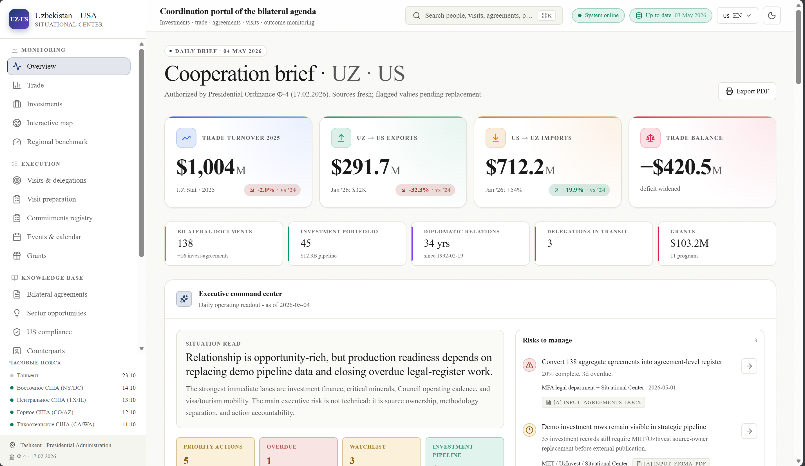
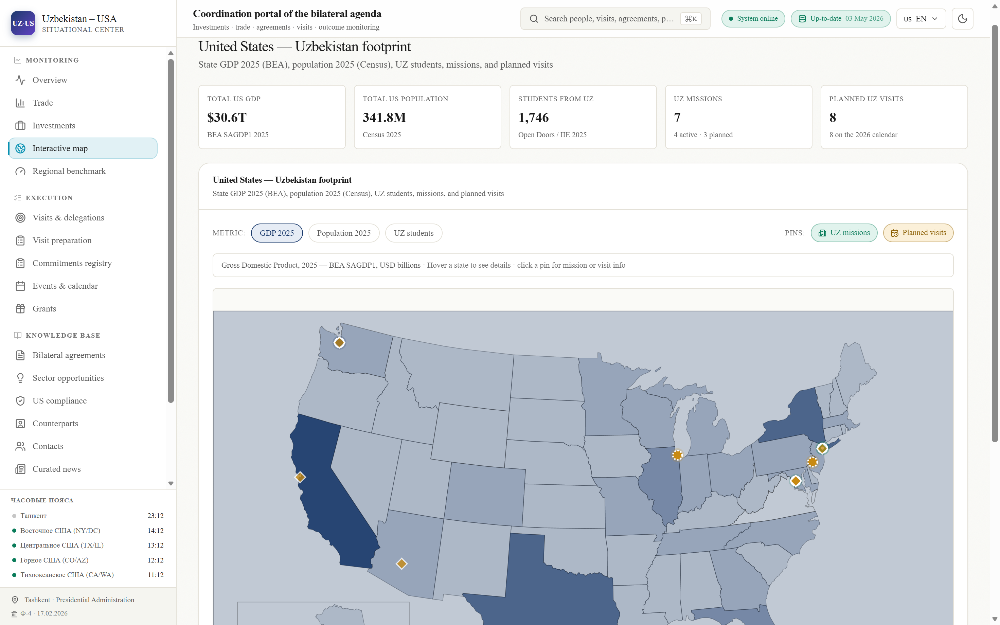
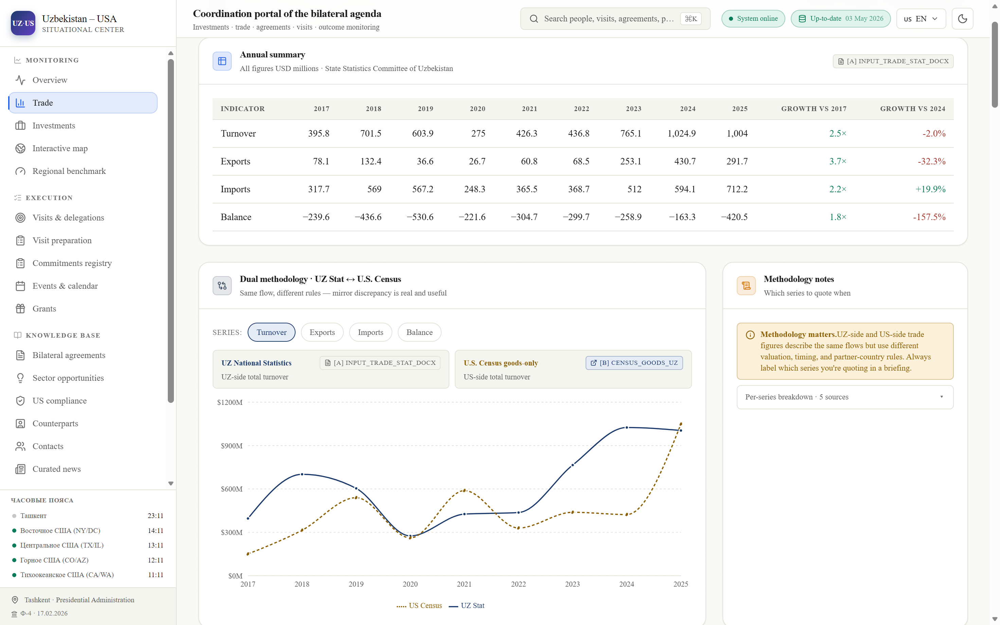
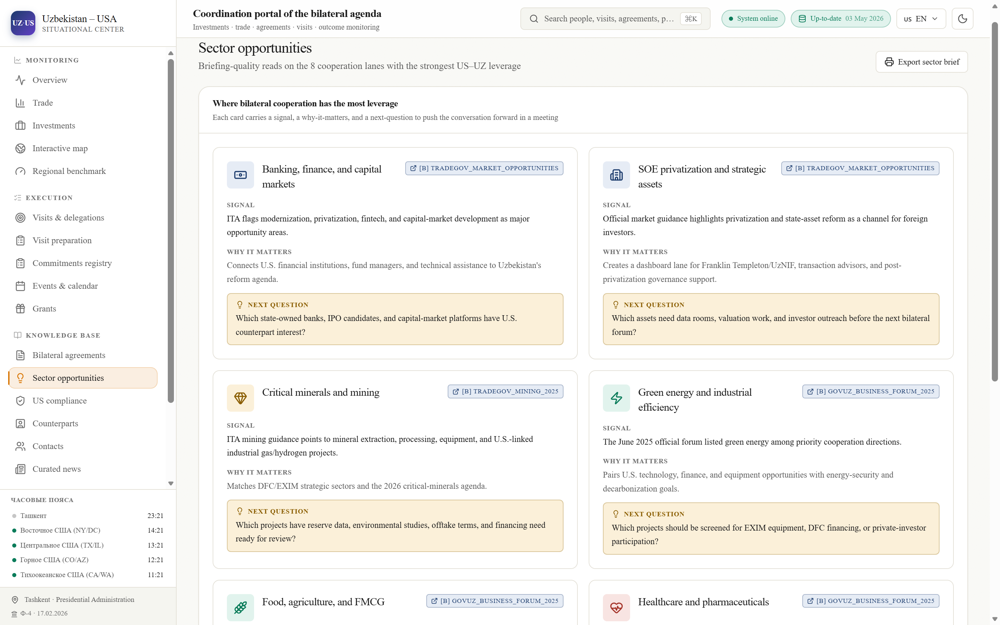
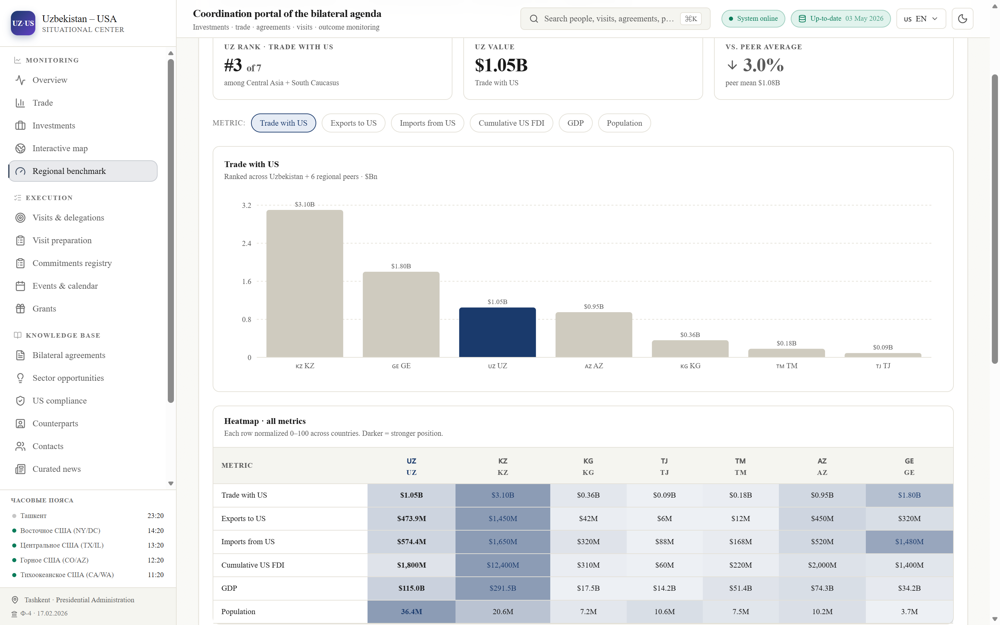

# UZ–US Situational Center · dashboard

> **[🌐 Live demo](https://uz-us-center.vercel.app/en)** · trilingual (EN / RU / UZ-Latn) · 21 routes · 56 data integrations · AI assistant on Claude Sonnet 4.6
>
> Deployment-candidate monitoring platform for the Situational Center on Uzbekistan–USA cooperation, authorized by Presidential Ordinance Ф-4 (17.02.2026). Built for the Advisor to the President, government officials, business stakeholders, and the Center's staff.



<table>
  <tr>
    <td width="50%"></td>
    <td width="50%"></td>
  </tr>
  <tr>
    <td width="50%"></td>
    <td width="50%"></td>
  </tr>
</table>

## What's inside

- **21 trilingual routes** (English, Russian, Uzbek-Latin) — overview, trade, investments, visits, agreements, commitments, grants, counterparts, sanctions and export-control compliance, regional benchmarking, an interactive U.S. states map, and an AI assistant.
- **~32,600 lines of hand-written TypeScript** across 93 React components, 34 source-of-truth data modules, 11 API routes, and 24 server-side library modules — all on Next.js 16.2 (App Router · Turbopack · React 19).
- **56 data integrations**: 1 operational PostgreSQL database (Supabase, 12-table schema with audit trail and review queue), 5 live API connectors (BEA, U.S. Census, EXIM, World Bank, ForeignAssistance.gov), and 50 cited primary sources from ~30 organisations (USTR, DFC, USAID, U.S. State Department, White House, UN Comtrade, OECD, ITC Trade Map, Open Doors / IIE, gov.uz, lex.uz, CBU, AUCC, US-UZ Council, and others).
- **Governed live-data layer** — daily Vercel cron at 07:00 UTC ingests fresh figures into a `raw_snapshot → normalized_observation → published_metric` pipeline; a no-downgrade policy keeps published metrics intact while reviewers approve revisions.
- **AI assistant** (Claude Sonnet 4.6) with prompt caching over a compiled RAG context spanning all 34 data modules.
- **Verification gate** — `pnpm verify` runs lint, typecheck, source/route validation, governance checks, and Vitest unit tests. Browser, accessibility, and Lighthouse checks are separate heavier commands and should be run before public release.
- **Lighthouse and axe coverage** — local sweep across all 17 routes shows **median Performance 91, median Accessibility 98** (six routes hit A11y 100); TBT 13–59 ms; CLS 0 everywhere. Charts lazy-loaded with IntersectionObserver, the map runtime is gated behind a load button, news/contacts filters are server-rendered. Lighthouse CI and Playwright/axe wired into the verification stack.
- **48 production commits** over ~3 weeks — full git history of architectural decisions, perf waves, and data-governance evolution.

> **Demo-ready with production-oriented guardrails.** Synthetic values should carry `is_demo: true` and be visually flagged. Investment records are split into verified, source-backed/pending, and illustrative/demo buckets so demo rows cannot be mistaken for official pipeline totals. See [`DEMO_DATA_REGISTRY.md`](./DEMO_DATA_REGISTRY.md), [`SOURCE_REGISTRY.md`](./SOURCE_REGISTRY.md), and [`DATA_INVENTORY.md`](./DATA_INVENTORY.md) for the provenance map.

Advanced charts, maps, and analytical exhibits are preserved through hierarchy instead of deletion. See [`VISUALIZATION_PRESERVATION_LOG.md`](./VISUALIZATION_PRESERVATION_LOG.md) for the current chart/table/map preservation record.

## Stack

### Frontend

| Layer         | Choice                                                                            |
| ------------- | --------------------------------------------------------------------------------- |
| Framework     | Next.js 16.2.4 · App Router · Turbopack · React 19.2                              |
| Styling       | Tailwind CSS v4 · CSS-var design tokens                                           |
| State         | Zustand v5 + persist                                                              |
| i18n          | next-intl v4 · 3 locales: `en`, `uz-latn`, `ru`                                   |
| Tables        | TanStack Table v8                                                                 |
| Charts        | Recharts (line/bar/area) · Visx (sankey/chord/treemap) · zero-dep SVG `<MiniBars />` |
| Maps          | maplibre-gl (OpenFreeMap) · Globe.gl · d3-geo Albers USA (lazy-loaded)            |
| Drag-and-drop | @dnd-kit (Visit Prep Kanban)                                                      |

### Backend & data layer

| Layer                | Choice                                                                                          |
| -------------------- | ----------------------------------------------------------------------------------------------- |
| Runtime              | Node.js 24 LTS on Vercel · V8 13 (Maglev) · Edge middleware for locale routing                  |
| API                  | 11 Next.js Route Handlers (`/api/admin/ingest/*`, `/api/cron/ingest`, `/api/data/*/latest`, `/api/live-data/*`, `/api/chat`) |
| Operational database | PostgreSQL 17 via Supabase · 12-table schema (audit log, source records, commitments, decisions, comments, ingest runs, raw snapshots, normalized observations, published metrics, review queue, source-version policy) |
| DB access            | Server-only Supabase REST adapter (`lib/db/adapter.ts`) — no JS client, ~30 KB saved on bundle |
| Live-data ingestion  | 5 official-source connectors (BEA · U.S. Census · EXIM · World Bank · ForeignAssistance.gov) hit by a daily Vercel cron at 07:00 UTC, lands in `raw_snapshot → normalized_observation → published_metric` pipeline |
| Data governance      | No-downgrade policy · pending-vs-published states · static fallback · full audit trail (`lib/data-governance/*`) |
| Auth                 | Signed, short-lived cookie password gate on `/admin` (server action + middleware) · role-aware  |
| AI                   | Vercel AI SDK v6 + `@ai-sdk/anthropic` v3 (Claude Sonnet 4.6) with prompt caching + streaming   |
| Build pipeline       | `pnpm verify` (lint + typecheck + 63-source / 204-reference / 21-route validation + governance + Vitest) gated in Vercel build command |
| Tests                | Vitest (unit) · Playwright (e2e + axe a11y) · Lighthouse CI · GitHub Actions workflow           |
| Package manager      | **pnpm**                                                                                        |

## Quick start

```bash
pnpm install
cp .env.example .env.local       # set ADMIN_PASSWORD; optionally enable the assistant
pnpm dev                         # → http://localhost:3000
```

Open `http://localhost:3000`; you'll be redirected to `/en` (or your browser's preferred locale). The root sidebar lists 19 public dashboard sections plus the gated admin area and counterpart detail pages.

### Common scripts

| Command                | What it does                                                             |
| ---------------------- | ------------------------------------------------------------------------ |
| `pnpm dev`             | Dev server with Turbopack hot reload                                     |
| `pnpm build`           | Production build (must pass before commit)                               |
| `pnpm typecheck`       | Strict TypeScript check (zero errors required)                           |
| `pnpm lint`            | ESLint over the full project                                             |
| `pnpm validate:data`   | Source-id, locale, route-manifest, and env-doc validation                |
| `pnpm smoke:routes`    | Fetches all localized routes from a running local server                 |
| `pnpm check:package`   | Checks tracked files for forbidden build/local artifacts                 |
| `pnpm probe:live`      | Probes optional public live-data connectors via a running server         |
| `pnpm test:governance` | Verifies no-downgrade policy, RLS tables, cron auth, and static fallback |
| `pnpm test:unit`       | Vitest unit tests for governance and parser logic                        |
| `pnpm test:e2e`        | Playwright browser route/API tests against a built local app             |
| `pnpm test:a11y`       | Playwright + axe accessibility checks for critical violations            |
| `pnpm knip`            | Finds unused dependencies, files, and exports                            |
| `pnpm format:check`    | Prettier formatting check                                                |
| `pnpm lhci`            | Lighthouse CI run against key dashboard pages                            |
| `pnpm verify`          | Lint + typecheck + data validation + governance checks + unit tests      |
| `pnpm start`           | Serve the production build locally                                       |

> **Cache note:** running `pnpm build` while `pnpm dev` is alive will clobber the Turbopack cache and cause "missing required error components" errors in the running dev server. Stop dev before running build, or use `pnpm typecheck` for fast verification during development.

## Routes (19 public sidebar sections × 3 locales + admin/login + counterpart SSG)

```
/[locale]/                       Overview (KPIs + globe + timeline + alerts)
/[locale]/trade                  UZ Stat ↔ U.S. Census dual-methodology view
/[locale]/visits                 Vertical timeline 1992–2026
/[locale]/prepare                Visit pipelines · Kanban · plan-vs-actual outcomes
/[locale]/commitments            TanStack Table · URL-synced status filter
/[locale]/agreements             Timeline + sphere/year filters
/[locale]/map                    Maplibre 3-layer + 3D globe toggle
/[locale]/admin                  Settings, registry viewer, audit log (gated)
/[locale]/admin/login            Password gate (no auth needed)
/[locale]/investments            Portfolio cards + sector/region/status filters
/[locale]/events                 Unified calendar + iCal export
/[locale]/grants                 7 UZ-side grant rows + 4 U.S.-side program records + ForeignAssistance.gov obligations
/[locale]/contacts               Org directory · 13-member Council roster
/[locale]/counterparts           Grid w/ role/party/stance filters
/[locale]/counterparts/[id]      SSG briefing card (21 × 3 locales = 63 paths)
/[locale]/sectors                8 sector-opportunity briefing cards
/[locale]/compliance             OFAC/BIS/EAR/ITAR/GSP/MFN status + ECCN calc
/[locale]/staff                  KPI table w/ composite-score ranking
/[locale]/news                   Curated press feed (16 verified entries)
/[locale]/assistant              AI chat (BYOK Anthropic key)
/[locale]/benchmark              UZ vs CA-5 + Caucasus ranking, heatmap

/api/chat                        Dynamic — Anthropic stream proxy (503 unless ASSISTANT_ENABLED=true and key is set)
```

## Deploy to Vercel

1. **Push to GitHub** (private repo recommended).
2. **Import** the repo in Vercel; framework auto-detects as Next.js.
3. **Set environment variables** in _Project Settings → Environment Variables_ (Production + Preview):
   - `ADMIN_PASSWORD` — required for the admin gate
   - `ADMIN_SESSION_SECRET` — strongly recommended; signs the admin session cookie independently of the password
   - `ASSISTANT_ENABLED=true` — optional; explicitly enables the `/assistant` server route
   - `ANTHROPIC_API_KEY` — optional; required together with `ASSISTANT_ENABLED=true`
   - `DATA_BACKEND=static` — default; keep this until a private operational database is provisioned
   - `SUPABASE_URL` / `SUPABASE_SERVICE_ROLE_KEY` — optional; server-only operational database adapter
   - `CRON_SECRET` — required before Vercel scheduled ingestion can call `/api/cron/ingest`
   - `CENSUS_API_KEY` — optional; improves U.S. Census International Trade API limits
   - `BEA_API_KEY` — optional; required before BEA services/ITA metadata can be ingested
   - `CENSUS_INGEST_MONTH` — optional `YYYY-MM`; defaults to the latest vetted static month until changed
4. **Deploy.** First build takes ~3 minutes.
5. **Custom domain** (optional): add via _Project Settings → Domains_.

The `/api/chat` route is a dynamic Node route; everything else is fully static and cached at the edge.

## QA tooling

The repo includes dev-only quality tools that do not ship runtime code to users:

- **Vitest** for fast unit coverage of source-governance rules.
- **Playwright** for real browser route, redirect, API, desktop, and mobile checks.
- **axe-core/playwright** for accessibility checks.
- **Lighthouse CI** for performance/accessibility regression snapshots.
- **Knip** for unused code/dependency discovery.
- **Prettier** for optional formatting normalization.

Run `pnpm build` before `pnpm test:e2e`, `pnpm test:a11y`, or `pnpm lhci`. For local browser checks, run `pnpm exec playwright install chromium` once. The GitHub workflow `Dashboard QA` is manual (`workflow_dispatch`) so heavy browser and Lighthouse runs do not slow every push unless you request them.

## Production operations

The overview now includes an executive command center, relationship pillars, source quality, and live-data readiness. The admin area includes a production-readiness panel covering security, CI, live-data, database, and workflow gaps.

Optional live public-data and governed-ingestion routes:

```
/api/live-data/health              Connector registry and environment readiness
/api/live-data/health?probe=1      Active public endpoint probe
/api/live-data/snapshot            Best-effort Census, World Bank, ForeignAssistance.gov, and EXIM pull
/api/data/trade/latest             Approved/current trade metrics, DB first with static fallback
/api/data/macro/latest             Approved/current macro metrics, DB first with static fallback
/api/data/assistance/latest        Approved/current assistance metrics, DB first with static fallback
/api/data/finance/latest           Approved/current finance metrics, DB first with static fallback
/api/admin/ingest/status           Admin-only connector/policy/database status
/api/admin/ingest/run              Admin-only dry-run; add ?write=1 only after DB/RLS approval
/api/cron/ingest                   Vercel cron endpoint; requires CRON_SECRET
```

The operational database schema lives at `database/schema.sql`. It is designed for Postgres/Supabase and covers users, sources, commitments, decisions, comments, audit logs, source-version policies, raw source snapshots, normalized observations, a review queue, and approved published metrics. Do not switch `DATA_BACKEND` away from `static` until auth, RLS, backups, and data-owner approval are in place.

Live ingestion follows a no-downgrade rule: if an official pull returns a period older than the currently approved metric, it is stored/reviewed but cannot replace the dashboard value. Same-period revisions require review. Newer values are publication candidates, not automatic replacements, unless a future source policy explicitly allows auto-publication.

## Repository and package hygiene

Do not include local/runtime artifacts in a deployment archive or handoff package. Keep `.git`, `.next`, `.vercel`, `node_modules`, `tsconfig.tsbuildinfo`, `lh-*.json`, local server logs, and `.claude/settings.local.json` out of shipped bundles. They are ignored for the repository, but the original zip handoff included several of them, so run:

```bash
pnpm check:package
```

before handoff, and run `node scripts/check-package-hygiene.mjs <extracted-package-directory>` against any archive you plan to share.

## Hard rules for contributors

1. **Real vs. demo data.** Every value in `data/*.ts` is either backed by a `sourceId` referencing `data/sources.ts` (real) **or** carries `is_demo: true` + an entry in [`DEMO_DATA_REGISTRY.md`](./DEMO_DATA_REGISTRY.md). Never invent numbers.
2. **Locale handling.** Every server page calls `setRequestLocale(locale)` after awaiting `params`.
3. **`<DemoBanner>` / `<DemoBadge>`** respect `hideDemo` and `presentationMode` from `useSettings`.
4. **Tokens, not literals.** Reference CSS vars (`var(--color-primary)`) defined in `app/globals.css`. Avoid raw hex except inside maplibre paint specs.
5. **`"use client"` discipline.** Server components by default. Wrap `useSearchParams` in `<Suspense>` at the page level.
6. **Print exports.** Use `<PrintButton />`; the `@media print` block in `globals.css` force-overrides dark-mode tokens for clean PDFs.
7. **AI gating.** `/api/chat` returns 503 unless `ASSISTANT_ENABLED=true` and `ANTHROPIC_API_KEY` are both configured. The client (`AssistantChat.tsx`) also checks server availability and `useSettings.aiEnabled`.

See [`CLAUDE.md`](./CLAUDE.md) for the full style and architectural guide future Claude Code sessions will follow.

## Source provenance

The single source of truth for every external citation is `data/sources.ts` (63 entries, level A = attached input, level B = official URL). Render any record with `<SourceBadge sourceId="…" />` to expose its provenance.

Most-used sources:

- **U.S. Census Bureau** trade-in-goods balance — [www.census.gov/foreign-trade/balance/c4644.html](https://www.census.gov/foreign-trade/balance/c4644.html)
- **USTR** Uzbekistan country page — [ustr.gov/Uzbekistan](https://ustr.gov/Uzbekistan)
- **EXIM** "Buy American, Build the Future" framework — [exim.gov press release](https://www.exim.gov/news/exim-signs-buy-american-build-future-agreement-uzbekistan-boost-exports-and-support-american)
- **DFC** Joint Investment Framework — [dfc.gov press release](https://www.dfc.gov/media/press-releases/dfc-leadership-lays-foundation-investment-partnership-uzbekistan)
- **U.S.-Uzbekistan Business Gateway** — [us-uz.gov.uz/en](https://us-uz.gov.uz/en)
- **National Statistics Committee** — UZ-side trade indicators 2017–2025 (attached DOCX)

## License

Internal — Office of the President of the Republic of Uzbekistan.
