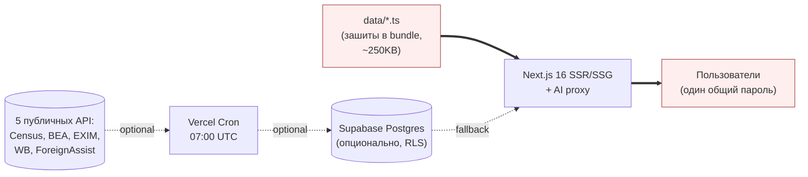
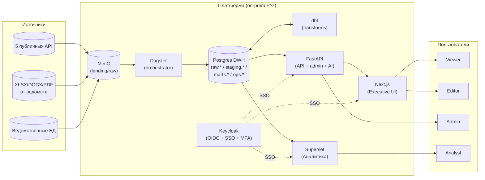

# Обзор архитектуры UZ–US Situational Center

## Назначение системы

Платформа — **аналитическая ситуационная среда** для Аппарата Президента, МИД, МИИП и хокимиятов по линии сотрудничества Узбекистан ↔ США. Авторизована Постановлением Президента Ф-4 (17.02.2026).

Аудитория:
- **Принимающие решения**: Советник Президента, Министры, Главы делегаций
- **Аналитический контур**: команда Центра ситуационного управления
- **Партнёры**: AUCC, представители UZ/US бизнеса, посольство

Главное product-обязательство: **репутационная безопасность данных**. Каждое значение либо подтверждено первоисточником, либо явно помечено как `is_demo: true` с пометкой ответственного ведомства.

---

## AS-IS vs TO-BE

### AS-IS (текущее состояние)

**Проблемы текущего состояния** (детально в [[07-bottlenecks-and-risks]]):
- 1 общий пароль вместо персональных учёток → нет аудита кто что сделал
- Данные зашиты в bundle → невозможно обновить без передеплоя
- `DATA_BACKEND=static` по умолчанию → governance-pipeline существует, но **не работает**
- Хостинг в США (Vercel `iad1`) → нарушение резидентности гос-данных РУз
- Нет наблюдаемости (только `console.error`)
- Нет CSP, нет rate-limit, нет SOC-аудита

### TO-BE (целевое состояние)

> [!tip] Принцип эволюции
> Целевая архитектура **не выбрасывает** существующий Next.js дашборд. Он остаётся **frontend-слоем для руководителей**, а вокруг него выстраивается полноценная data-платформа.

См. визуальную версию: [[diagrams/c4-container]]

---

## Ключевые архитектурные решения (ADR-краткие)

| # | Решение | Альтернативы | Обоснование |
|---|---|---|---|
| 1 | **Postgres 17 как DWH** | ClickHouse, Snowflake, BigQuery | Объёмы малы (~10⁴–10⁵ строк/год), Postgres + индексы достаточно. Знакомая команде технология. |
| 2 | **dbt для трансформаций** | Hand-rolled SQL, Spark | SQL-first, тестируемо, документация lineage из коробки. Заменяет ad-hoc скрипты. |
| 3 | **Dagster (не Airflow)** | Airflow, Prefect | Asset-first модель совпадает с `published_metric`/`metric_identity`. Lineage UI бесплатно. Легче, чем Airflow. |
| 4 | **FastAPI как backend API** | Next.js Route Handlers, Express | Зрелые OIDC-библиотеки (`authlib`), нативный Pydantic, автогенерация OpenAPI, легче подключить E-IMZO/OneID. |
| 5 | **Keycloak as IdP** | Auth0, Okta, AzureAD | On-prem обязателен. OSS, поддерживает OIDC + SAML + LDAP federation, бесплатен. |
| 6 | **Next.js остаётся для UI руководителей** | Чистый React + Vite | Уже инвестировано в SSR/i18n/design tokens. SEO не важно, но performance важно. |
| 7 | **Superset для аналитиков** | Metabase, Redash, Power BI | OSS, on-prem, RLS на уровне Postgres, SQL Lab для analyst-команды. |
| 8 | **MinIO как landing zone** | AWS S3, Azure Blob | Резидентность РУз. S3-совместимый API → можно мигрировать без изменения кода. |
| 9 | **OpenTelemetry + Sentry + Grafana** | Datadog, New Relic | OSS-стек, on-prem, без внешних зависимостей. |
| 10 | **Docker Compose → Kubernetes** | Только Compose, чистый VM | Compose для staging/dev (1 узел), K8s (k3s) для прод (HA, секреты). |

Подробное обсуждение → [[01-target-architecture]] и [[07-bottlenecks-and-risks]].

---

## Scope: что входит и что не входит

### Входит в эту документацию
- ✅ Архитектура платформы (compute, data, security)
- ✅ Пути 5 ролей пользователей
- ✅ Бизнес-процессы (ingestion, publication, commitment lifecycle)
- ✅ Модель данных (DWH-слои + операционная схема)
- ✅ Развёртывание on-prem
- ✅ Узкие места и риски

### Не входит (требует отдельной документации)
- ❌ Детальный UI/UX дизайн (Figma)
- ❌ Сетевые регламенты (firewall rules, VLAN) — отдельный документ от ИБ-команды
- ❌ Договорная и регуляторная часть (DPA, лицензии)
- ❌ Финансовый план (CapEx/OpEx)
- ❌ Detailed test plans (отдельный QA-плэн)

---

## Связанные сущности из CLAUDE.md, которые остаются неизменными

> [!important] Жёсткие правила, наследуемые из текущей версии
> Эти правила **не пересматриваются** при переходе на целевую архитектуру.

1. **Visit-prep PII boundary** — НИ В КАКОМ ВИДЕ платформа не хранит: номера паспортов, виз, PNR, гостиничные брони, текст talking points, тела MoU, индивидуальные имена делегатов, личные контакты.
2. **No-downgrade policy** — старший период не может заместить более новый утверждённый. См. [[04-data-flow#No-downgrade]].
3. **Demo-флаги** — все синтетические значения видимо помечены, скрываются по `hideDemo`/`presentationMode`.
4. **Tokens, not literals** — все цвета через CSS-переменные дизайн-токенов.
5. **`is_demo: true` → запись в DEMO_DATA_REGISTRY** — обязательно.

---

## Дальше

- Целевая архитектура с диаграммами → [[01-target-architecture]]
- Что и зачем в каждом контейнере → [[02-component-catalog]]
- Как пользователь входит и работает → [[05-user-journeys]]
- Какие риски остаются в TO-BE → [[07-bottlenecks-and-risks]]
- Как переходить из AS-IS в TO-BE → [[08-migration-roadmap]]
