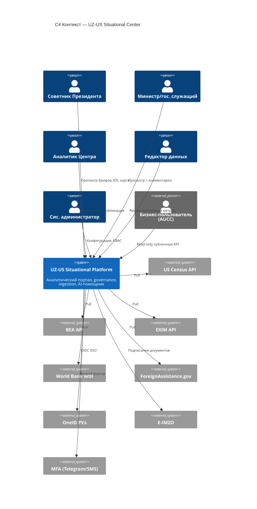
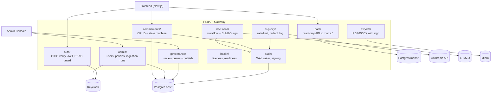
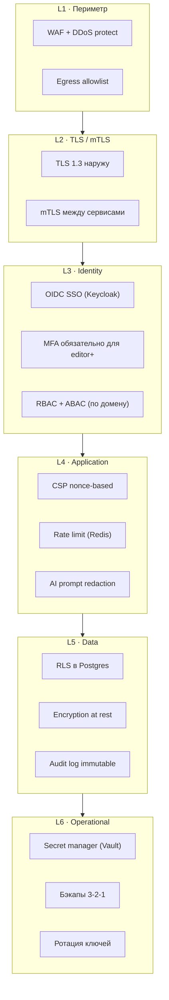

# Целевая архитектура

## C4 Уровень 1 — Системный контекст

> [!info] Диаграмма
> [[diagrams/c4-context|drawio]] · [[#Inline mermaid · контекст|inline]]

### Внешние акторы

| Актор                       | Роль                 | Контакт с системой       |
| --------------------------- | -------------------- | ------------------------ |
| **Советник Президента**     | Главный потребитель  | UI Frontend (Next.js)    |
| **Министры/гос. служащие**  | Принимающие решения  | UI Frontend              |
| **Аналитики Центра**        | Готовят данные       | UI Frontend + Superset   |
| **Редакторы данных**        | Подтверждают/правят  | UI Frontend (`/admin`)   |
| **Системный администратор** | Управляет платформой | Admin Console + Keycloak |
| **External user (бизнес)**  | Прохождение AUCC     | UI Frontend (read-only)  |

### Внешние системы

| Система                              | Назначение                    | Тип контакта                     |
| ------------------------------------ | ----------------------------- | -------------------------------- |
| **Census Bureau API**                | US-сторонние торговые данные  | Outbound HTTPS, API key          |
| **BEA API**                          | US макро/услуги               | Outbound HTTPS, API key          |
| **EXIM API**                         | Экспорт-кредиты               | Outbound HTTPS                   |
| **World Bank WDI**                   | Макро-индикаторы              | Outbound HTTPS                   |
| **ForeignAssistance.gov**            | Обязательства USAID           | Outbound HTTPS                   |
| **OneID РУз**                        | SSO для внешних пользователей | OIDC                             |
| **E-IMZO**                           | Цифровая подпись документов   | Browser-side SDK + server verify |
| **MFA-провайдер (Telegram bot/SMS)** | Второй фактор                 | Outbound API                     |
| **SMTP-relay**                       | Уведомления                   | Outbound                         |
| **CERT-UZ / GosSUZI**                | Compliance, аудит             | Контрольный доступ               |

### Inline mermaid · контекст



---

## C4 Уровень 2 — Контейнеры

> [!info] Диаграмма
> [[diagrams/c4-container|drawio]] — основная диаграмма архитектуры.

### Слои платформы

```
┌─────────────────────────────────────────────────────────────────────────┐
│                          PRESENTATION                                    │
│  ┌──────────────┐  ┌──────────────┐  ┌──────────────┐                  │
│  │   Next.js    │  │  Superset    │  │ Admin Console│                  │
│  │ Executive UI │  │  (Analyst)   │  │   (FastAPI)  │                  │
│  └──────┬───────┘  └──────┬───────┘  └──────┬───────┘                  │
└─────────┼──────────────────┼─────────────────┼─────────────────────────┘
          │                  │                 │
┌─────────┼──────────────────┼─────────────────┼─────────────────────────┐
│         │     APPLICATION / SERVICES          │                         │
│  ┌──────▼───────────────────────────────────────▼──────┐                │
│  │              FastAPI Gateway                         │                │
│  │  /api/v1/* · auth middleware · OpenAPI · audit       │                │
│  │                                                      │                │
│  │  Modules: data · governance · admin · ai-proxy ·    │                │
│  │           commitments · decisions · exports         │                │
│  └────┬─────────────┬─────────────┬─────────────┬──────┘                │
│       │             │             │             │                        │
│  ┌────▼────┐  ┌─────▼──────┐  ┌──▼──────┐  ┌──▼──────┐                │
│  │ Keycloak│  │ Anthropic  │  │  Email  │  │ E-IMZO  │                │
│  │  (IdP)  │  │  (claude)  │  │ Telegram│  │ verify  │                │
│  └─────────┘  └────────────┘  └─────────┘  └─────────┘                │
└─────────────────────────────────────────────────────────────────────────┘
          │                  │                 │
┌─────────┼──────────────────┼─────────────────┼─────────────────────────┐
│         │       DATA / STORAGE                │                         │
│  ┌──────▼──────────────────▼──────────────────▼─────┐                   │
│  │              PostgreSQL DWH (HA pair)             │                   │
│  │                                                   │                   │
│  │    raw.*       — снимки источников (JSONB)        │                   │
│  │    staging.*   — типизированные наблюдения         │                   │
│  │    marts.*     — published_metric, агрегаты        │                   │
│  │    ops.*       — commitments, decisions, audit    │                   │
│  │    auth.*      — RBAC mapping (синк с Keycloak)   │                   │
│  └───────────────────────────────────────────────────┘                   │
│                                                                          │
│  ┌──────────────────────┐  ┌──────────────────┐  ┌──────────────────┐  │
│  │   MinIO (S3-compat)  │  │  Redis (cache +  │  │  PostgreSQL      │  │
│  │   raw/ exports/      │  │  rate-limit)     │  │  (Keycloak DB)   │  │
│  │   reports/ pdfs/     │  │                  │  │                  │  │
│  └──────────────────────┘  └──────────────────┘  └──────────────────┘  │
└──────────────────────────────────────────────────────────────────────────┘
          ▲
┌─────────┼─────────────────────────────────────────────────────────────┐
│         │       DATA-INTEGRATION                                       │
│  ┌──────┴──────────┐    ┌────────────────┐    ┌──────────────────┐   │
│  │     Dagster     │    │      dbt       │    │   File watcher   │   │
│  │  (orchestrator) │    │  (transforms)  │    │ (XLSX/PDF inbox) │   │
│  └─────────────────┘    └────────────────┘    └──────────────────┘   │
└──────────────────────────────────────────────────────────────────────┘
          ▲
┌─────────┼─────────────────────────────────────────────────────────────┐
│         │       OBSERVABILITY                                         │
│  ┌──────┴──────┐  ┌─────────┐  ┌──────────┐  ┌────────────────┐     │
│  │  OpenTelem. │→ │ Tempo   │  │  Loki    │  │   Grafana       │    │
│  │  collector  │  │ (traces)│  │ (logs)   │  │  (dashboards)   │    │
│  │             │  │         │  │          │  │  + Alertmanager │    │
│  └─────────────┘  └─────────┘  └──────────┘  └────────────────┘     │
│                                              ┌────────────────┐      │
│                                              │   Sentry       │      │
│                                              │ (error tracker)│      │
│                                              └────────────────┘      │
└──────────────────────────────────────────────────────────────────────┘
```

См. полную интерактивную версию: [[diagrams/c4-container]]

### Контейнеры и их назначение

| Контейнер                   | Технология                                 | Назначение                                             |
| --------------------------- | ------------------------------------------ | ------------------------------------------------------ |
| **Next.js UI**              | Next.js 16, React 19, TS, Tailwind v4      | Executive UX для руководителей. SSR-страницы → API     |
| **FastAPI Gateway**         | Python 3.13, FastAPI, Pydantic v2, asyncpg | Основной API + admin + AI-proxy + аудит                |
| **Superset**                | Apache Superset 4                          | SQL Lab + ad-hoc дашборды для аналитиков               |
| **Admin Console**           | FastAPI + HTMX или Next.js                 | Управление RBAC, политиками источников, ingestion-runs |
| **Keycloak**                | Keycloak 26                                | IdP: OIDC, MFA, federation с OneID/AD                  |
| **PostgreSQL DWH**          | Postgres 17                                | Все слои данных (raw/staging/marts/ops)                |
| **MinIO**                   | MinIO RELEASE                              | S3-совместимый объектный сторадж (raw, exports, PDF)   |
| **Redis**                   | Redis 8                                    | Cache, rate-limit, фоновые очереди                     |
| **Dagster**                 | Dagster 1.x                                | Оркестратор ingestion-DAG'ов                           |
| **dbt-core**                | dbt 1.9                                    | SQL-трансформации raw → staging → marts                |
| **OpenTelemetry Collector** | Otel-collector                             | Сбор трасс/логов/метрик из всех сервисов               |
| **Loki + Tempo + Grafana**  | LGTM-stack                                 | Логи, трейсы, дашборды, алерты                         |
| **Sentry**                  | Sentry self-hosted                         | Ошибки frontend и backend                              |
| **Nginx / Traefik**         | Traefik 3                                  | TLS termination, маршрутизация, mTLS до сервисов       |

Каждый контейнер описан подробнее в [[02-component-catalog]].

---

## C4 Уровень 3 — Компоненты FastAPI

> [!info] Диаграмма
> [[diagrams/c4-component]]



---

## Развёртывание

> [!info] Диаграмма
> [[diagrams/deployment]] — деталь развёртывания on-prem.

### Топология (целевая)

```
┌────────────────────────────── DMZ ──────────────────────────────────┐
│                                                                       │
│   ┌──────────────────────┐         ┌──────────────────────────┐     │
│   │  Traefik (HA pair)    │  ←TLS→  │  WAF / Rate-limit edge   │     │
│   │  + Let's Encrypt      │         │  (CrowdSec / ModSecurity)│     │
│   └──────────┬───────────┘         └──────────────────────────┘     │
└──────────────┼────────────────────────────────────────────────────────┘
               │ mTLS
┌──────────────▼────────────────────────────────────────────────────────┐
│                       APP-CLUSTER (k3s)                                │
│   ┌──────────┐  ┌──────────┐  ┌──────────┐  ┌──────────┐  ┌────────┐ │
│   │  Next.js │  │ FastAPI  │  │ Superset │  │ Keycloak │  │ Dagster│ │
│   │   x2     │  │   x3     │  │    x2    │  │    x2    │  │   x1   │ │
│   └──────────┘  └──────────┘  └──────────┘  └──────────┘  └────────┘ │
│                                                                        │
│   ┌──────────┐  ┌──────────┐                                          │
│   │  Otel    │  │  Sentry  │                                          │
│   │ Collector│  │          │                                          │
│   └──────────┘  └──────────┘                                          │
└────────────────────────────────────────────────────────────────────────┘
                                │
┌───────────────────────────────▼──────────────────────────────────────┐
│                       DATA-CLUSTER                                    │
│                                                                        │
│   ┌────────────────────┐    ┌──────────────┐    ┌─────────────────┐  │
│   │ Postgres 17        │    │ MinIO Cluster│    │ Redis Sentinel  │  │
│   │ Primary + Replica  │    │   3 nodes    │    │  primary + 2    │  │
│   │ (Patroni + etcd)   │    │              │    │                 │  │
│   └────────────────────┘    └──────────────┘    └─────────────────┘  │
│                                                                        │
│   Backups: pgBackRest → MinIO ext bucket → off-site cold storage     │
└────────────────────────────────────────────────────────────────────────┘
                                │
┌───────────────────────────────▼──────────────────────────────────────┐
│                       INTEGRATION-OUTBOUND                            │
│                                                                        │
│   Egress proxy (squid) → only allowlisted FQDN:                       │
│   - api.census.gov                                                    │
│   - api.bea.gov                                                       │
│   - api.exim.gov                                                      │
│   - api.worldbank.org                                                 │
│   - api.foreignassistance.gov                                         │
│   - api.anthropic.com                                                 │
│   - oneid.uz                                                          │
└────────────────────────────────────────────────────────────────────────┘
```

### Окружения

| Окружение      | Назначение           | Топология                       | Compliance         |
| -------------- | -------------------- | ------------------------------- | ------------------ |
| **dev**        | Локальная разработка | Docker Compose, 1 узел          | —                  |
| **staging**    | Pre-prod, демо       | k3s 3 узла, общая БД            | —                  |
| **production** | Боевое использование | k3s HA + отдельный data-cluster | Аттестация GosSUZI |
| **DR**         | Восстановление       | Холодная копия в другом ЦОД     | RPO 4ч / RTO 8ч    |

---

## Безопасность · Defense-in-depth



Подробности → [[03-authentication-rbac]] и [[07-bottlenecks-and-risks]].

---

## Принципы

1. **On-prem first**. Любой компонент должен запускаться без внешних SaaS-зависимостей. Внешние API — только источники, без них работа продолжается на DWH.
2. **Boring tech**. Postgres, Redis, Nginx — выбор зрелых, понятных команде технологий вместо хайповых.
3. **Single source of truth**. Один контракт между слоями: Pydantic-модели → OpenAPI → TS-типы. Без ручной синхронизации.
4. **Audit-by-default**. Каждое мутирующее действие пишется в `ops.audit_log`. Нет «тихих» правок.
5. **No-downgrade**. Существующая политика [[04-data-flow#No-downgrade]] сохраняется и переезжает в `dbt test`.
6. **Static fallback**. Public-страницы должны рендериться даже при недоступной БД (graceful degradation на seed-данные).
7. **Observability-by-default**. Каждый сервис эмитит трасы, метрики и структурированные логи через OTel.
8. **Secrets out of code**. Все секреты в Vault или K8s secrets, не в env.local.

---

## Ограничения и trade-offs

> [!warning] Сложность
> Целевая архитектура добавляет 8–10 сервисов к существующему стеку. Это требует:
>
> - 2–3 штатных инженеров эксплуатации (DevOps/SRE),
> - runbook'ов для каждого инцидентного сценария,
> - регулярного DR-теста (раз в квартал).
>
> Если эксплуатационная команда меньше 2 человек — упрощённый вариант: пропустить Dagster и Superset, оставить FastAPI + Postgres + Next.js + Keycloak. См. [[08-migration-roadmap#Прагматичный минимум]].

> [!warning] Связанность через Postgres
> DWH — central nervous system. Если Postgres лежит, лежит всё. Поэтому: HA-пара через Patroni, репликация в DR, бэкапы 3-2-1, regular failover-drill.

> [!note] Альтернатива «чистого React + Vite»
> Решение оставить Next.js принято, потому что вы уже инвестировали в SSR-страницы, design tokens, i18n. Переход на Vite + React сэкономил бы ~10% bundle, но стоил бы ~3 спринтов миграции и потери печатных стилей. Не оправдано.

---

## Дальше

- Каждый компонент детально → [[02-component-catalog]]
- Как пользователь идёт через систему → [[05-user-journeys]]
- Как данные движутся → [[04-data-flow]]
