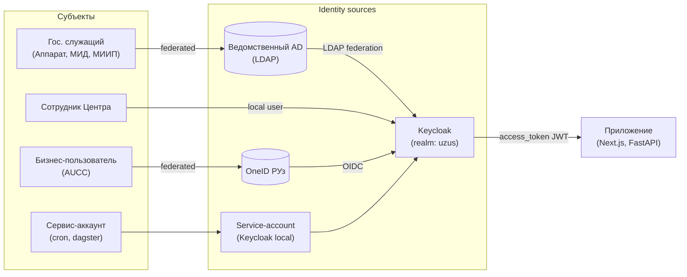
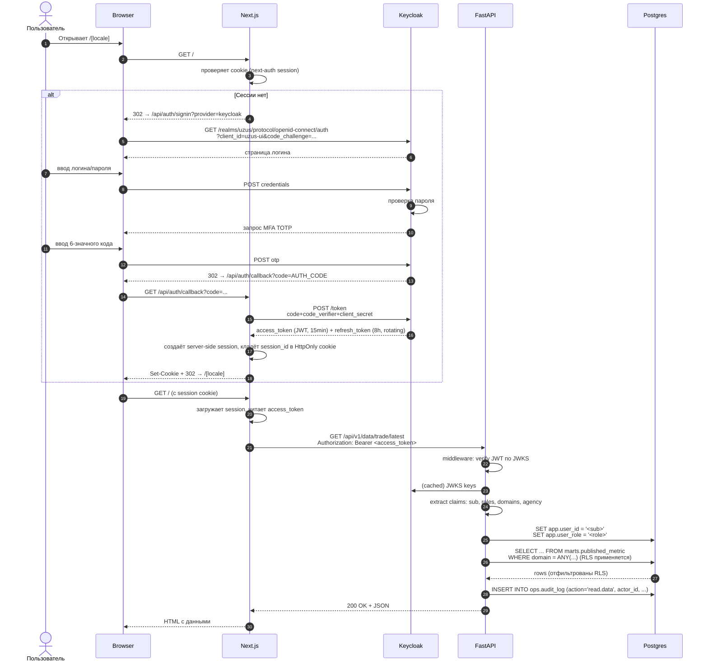

# Аутентификация и авторизация

## Модель в одной фразе

> [!important] Принцип
> **Кто** — Keycloak (OIDC), **что разрешено делать** — RBAC + ABAC в FastAPI, **что видно в БД** — RLS в Postgres. Три слоя контроля, **проверка на каждом**.

---

## Идентификация (кто вы)

### Federation-стратегия



| Категория | Источник | MFA | Особенности |
|---|---|---|---|
| Гос. служащий | LDAP federation (если есть AD) | ✅ TOTP | Группы AD → Keycloak roles через mapper |
| Сотрудник Центра | Keycloak local users | ✅ TOTP | Создаются админом, password rotation 90 дней |
| Бизнес-пользователь | OneID РУз | ✅ (от OneID) | Только viewer + ограниченные домены |
| Сервис-аккаунт | Client credentials grant | — | client_id/secret в Vault, ротация 30 дней |

> [!warning] Зачем federation, а не отдельные пароли
> Если у пользователя есть учётка в ведомственном AD, **новый пароль не выдаётся**. Это устраняет риск parol123 и совпадает с требованиями к гос-системам РУз о привязке к корпоративной учётке.

---

## Аутентификация · OIDC + MFA

### Authorization Code Flow с PKCE



См. визуальный sequence: [[diagrams/auth-sequence]]

### JWT-конфигурация

| Поле | Значение |
|---|---|
| **Algorithm** | RS256 (асимметричный) |
| **Issuer** | `https://auth.uzus.local/realms/uzus` |
| **Audience** | `uzus-ui`, `uzus-api`, `uzus-superset` (разные клиенты) |
| **Access token TTL** | 15 минут |
| **Refresh token TTL** | 8 часов · ротация при каждом use |
| **Claims** | `sub`, `email`, `roles[]`, `domains[]`, `agency`, `mfa: true` |
| **Передача** | `Authorization: Bearer ...` (никогда не в URL) |
| **Storage на frontend** | **только server-side session** в Next.js, токены не уходят в browser JS |

### Защита от типовых атак

| Атака | Контрмера |
|---|---|
| Brute force /login | Keycloak brute-force detector + CrowdSec на edge (lockout 30 минут после 5 неудач) |
| Credential stuffing | HIBP-check паролей при создании · MFA обязательно |
| Session fixation | Pre-auth random `state` + server-side session id ротируется на login |
| CSRF | SameSite=Lax cookies + CSRF-токены для state-changing форм |
| Token theft | HttpOnly + Secure cookies; короткий TTL access; ротация refresh |
| MITM | TLS 1.3 only, HSTS preload, mTLS внутри кластера |
| OIDC mix-up | strict `iss`/`aud` validation, PKCE обязательно для public clients |
| Replay attacks | `jti` claim + Redis blacklist при logout |

---

## Авторизация · RBAC + ABAC

### Роли и разрешения

> [!info] Базовая RBAC-модель
> Унаследована и расширена из [lib/auth/roles.ts](../../lib/auth/roles.ts). Существующая структура верная — добавляются новые permissions для новых модулей.

```yaml
# Single source of truth: domain/auth/permissions.py (Pydantic)
roles:
  viewer:
    description: Стандартный читатель — KPI, графики, отчёты
    permissions:
      - dashboard:view
      - source:view
      - export:read

  analyst:
    description: Аналитик Центра — готовит данные, не утверждает
    inherits: [viewer]
    permissions:
      - commitment:edit
      - decision:draft
      - superset:access
      - export:create

  editor:
    description: Редактор данных — утверждает метрики, источники
    inherits: [analyst]
    permissions:
      - source:approve
      - metric:publish
      - review-queue:approve
      - review-queue:reject

  executive:
    description: Принимающий решения (министр, советник)
    inherits: [viewer]
    permissions:
      - decision:approve
      - decision:reject
      - comment:create
      - notification:configure

  admin:
    description: Системный администратор
    inherits: [editor, executive]
    permissions:
      - user:manage
      - role:assign
      - policy:edit
      - audit:export
      - admin:view
      - ingestion:trigger
      - ai:configure
```

### ABAC · домен-уровневые ограничения

> [!note] Зачем ABAC
> RBAC говорит «editor может редактировать», ABAC уточняет «но только в домене `trade`, не в `security`». Например, аналитик МИИП работает с `trade`/`investment`, но не должен видеть `security` (санкционные кейсы).

Пример матрицы:

| Роль × Домен | trade | macro | assistance | finance | mobility | education | security | operations |
|---|---|---|---|---|---|---|---|---|
| viewer | R | R | R | R | R | R | — | — |
| analyst (МИИП) | RW | R | R | RW | — | — | — | R |
| analyst (МИД) | R | R | RW | R | RW | RW | R | — |
| editor (всех) | RW | RW | RW | RW | RW | RW | RW | R |
| executive | R | R | R | R | R | R | R | R |
| admin | RW | RW | RW | RW | RW | RW | RW | RW |

Реализация: claim `domains[]` в JWT → FastAPI guard сверяет с запрашиваемым доменом → Postgres RLS-policy проверяет `current_setting('app.user_domains')`.

### Матрица доступов на ресурсы

См. визуально [[diagrams/rbac-matrix]].

| Ресурс / Действие | viewer | analyst | editor | executive | admin |
|---|---|---|---|---|---|
| `GET /api/v1/data/*/latest` | ✅ (по доменам) | ✅ | ✅ | ✅ | ✅ |
| `GET /api/v1/data/*/history` | ✅ | ✅ | ✅ | ✅ | ✅ |
| `GET /api/v1/governance/review-queue` | — | ✅ | ✅ | — | ✅ |
| `POST /api/v1/governance/publish` | — | — | ✅ | — | ✅ |
| `POST /api/v1/governance/reject` | — | — | ✅ | — | ✅ |
| `POST /api/v1/commitments` | — | ✅ | ✅ | — | ✅ |
| `PATCH /api/v1/commitments/{id}` | — | ✅ (own) | ✅ | — | ✅ |
| `POST /api/v1/decisions` | — | ✅ (draft) | ✅ | — | ✅ |
| `POST /api/v1/decisions/{id}/approve` | — | — | — | ✅ | ✅ |
| `POST /api/v1/exports/pdf` | ✅ | ✅ | ✅ | ✅ | ✅ |
| `POST /api/v1/ai/chat` | ✅ (rate-lim) | ✅ | ✅ | ✅ | ✅ |
| `GET /api/v1/admin/users` | — | — | — | — | ✅ |
| `POST /api/v1/admin/users` | — | — | — | — | ✅ |
| `POST /api/v1/admin/policies` | — | — | — | — | ✅ |
| `GET /api/v1/audit` | — | — | ✅ (own) | ✅ (own) | ✅ |
| `POST /api/v1/ingestion/trigger` | — | — | — | — | ✅ |
| Superset doors | — | ✅ | ✅ | — | ✅ |

---

## Контроль на 3 слоях

### Слой 1 — Frontend (UX-guard)

UI **прячет** действия, на которые у пользователя нет прав. Это UX, не security:

```tsx
// next-ui/lib/permissions.ts
export function can(session: Session, perm: Permission): boolean {
  return session.user.permissions.includes(perm);
}

// Использование:
{can(session, "decision:approve") && <ApproveButton />}
```

> [!warning]
> Frontend hide ≠ security. Реальный контроль — на backend.

### Слой 2 — FastAPI middleware

```python
# fastapi-gateway/app/core/security.py
def require_permission(perm: Permission):
    async def guard(token: TokenPayload = Depends(verify_token)):
        if perm not in token.permissions:
            raise HTTPException(403, "forbidden")
        if perm.is_domain_scoped and not domains_intersect(token.domains, requested):
            raise HTTPException(403, "forbidden_domain")
        return token
    return guard

# Использование:
@router.post("/governance/publish", dependencies=[Depends(require_permission("metric:publish"))])
async def publish(...):
    ...
```

### Слой 3 — Postgres RLS

```sql
-- Включаем RLS на все чувствительные таблицы
alter table marts.published_metric enable row level security;

-- Политика: видны только разрешённые домены
create policy view_by_domain on marts.published_metric
  for select to app_role
  using (
    domain = ANY (string_to_array(current_setting('app.user_domains'), ','))
  );

-- FastAPI перед запросом устанавливает GUC
SET LOCAL app.user_id = '<sub>';
SET LOCAL app.user_domains = 'trade,assistance';
SET LOCAL app.user_role = 'analyst';
```

> [!important] Defense in depth
> Если злоумышленник пробьёт middleware (баг, SSRF), RLS его не пустит к чужим доменам. Если кто-то напрямую подключится к БД через скомпрометированный сервис-аккаунт без установки GUC, **default deny** не отдаст ничего.

---

## Аудит каждого действия

Каждое state-changing API-вызов пишет в `ops.audit_log`:

```json
{
  "id": "01HXYZ...",
  "actor_id": "uuid-from-keycloak-sub",
  "actor_role": "editor",
  "actor_agency": "МИД",
  "actor_ip": "10.20.30.40",
  "action": "metric:publish",
  "entity_type": "published_metric",
  "entity_id": "trade.us.goods.monthly.exports::2026-04-30",
  "before_data": {"value": 38.1, "approved_by": "..."},
  "after_data": {"value": 39.4, "approved_by": "<sub>"},
  "reason": "Census data revised on 2026-05-04",
  "trace_id": "otel-trace-id",
  "created_at": "2026-05-06T07:42:13Z",
  "signature": "ed25519(sha256(row))"  -- WORM-протекция
}
```

**Свойства**:
- WORM (write-once, read-many): `INSERT` only. Триггер запрещает `UPDATE`/`DELETE` через `before update do nothing`.
- Подпись каждой записи приватным ключом backend (Ed25519). Ключ в Vault. Внешний верификатор может проверить целостность лога.
- Экспорт: `admin` может выгрузить отрезок в подписанный JSON для регулятора.
- Retention: 7 лет (требование к гос. системам).

---

## Sessions, logout, revocation

### Active sessions

- Все активные сессии видны в Keycloak Admin UI.
- Admin может **force-logout** конкретного пользователя (revoke session).
- Refresh-token rotation: при каждом использовании старый аннулируется.

### Logout flow

1. UI: `POST /api/auth/signout` → next-auth уничтожает server session
2. Next-auth: `POST /realms/uzus/protocol/openid-connect/logout` → Keycloak invalidates SSO session
3. FastAPI: на следующий request видит истёкший token → 401
4. Audit-log: запись `auth:logout` с reason

### Token revocation

- Access tokens (15 min) — не отзываются, ждём истечения.
- Refresh tokens — отзываются при logout / password change / admin force-logout.
- Service accounts — ротация client_secret через Vault.

---

## Storage модели данных пользователей

### Таблицы (ops/auth schemas)

```sql
-- Зеркало пользователей из Keycloak (FK для audit_log, comments, etc)
create table auth.app_user (
  id uuid primary key,                         -- = Keycloak sub
  email text not null unique,
  display_name text not null,
  agency text,
  primary_role text not null,                  -- кэшируется для быстрых запросов
  domains text[] not null default '{}',
  active boolean not null default true,
  last_seen_at timestamptz,
  created_at timestamptz default now(),
  updated_at timestamptz default now()
);

-- Синхронизация: webhook от Keycloak event listener → FastAPI /internal/auth/sync
-- + nightly full sync через KC Admin API
```

### Per-user UI preferences

```sql
create table ops.user_preferences (
  user_id uuid primary key references auth.app_user(id),
  theme text default 'light',
  hide_demo boolean default false,
  presentation_mode boolean default false,
  ai_enabled boolean default false,
  default_domain text,
  notification_channels jsonb default '{}',  -- email/telegram per event-type
  updated_at timestamptz default now()
);
```

> [!note] Замена localStorage
> Сейчас preferences живут в `localStorage` ([lib/store/settings.ts](../../lib/store/settings.ts)) — они теряются при смене устройства. После SSO их синхронизируем server-side: на каждом login Next.js подтягивает `user_preferences` из FastAPI и зеркалит в Zustand для оффлайн-UX.

---

## Compliance с законодательством РУз

### Закон РУз №ЗРУ-547 «О персональных данных»

| Требование | Реализация |
|---|---|
| Хранение ПДн на территории РУз | DWH, MinIO, Keycloak — все on-prem в РУз |
| Согласие субъекта | При первом login — экран согласия (для бизнес-пользователей) |
| Минимизация | Храним только email + display_name + agency, не ФИО детально |
| Право на удаление | `DELETE` каскадно через FastAPI `/admin/users/{id}` (audit-лог сохраняется в анонимизированной форме — `actor_id` остаётся, `email` обнуляется) |
| Реестр обработки | Документ DPIA в `docs/compliance/` (отдельный) |

### CERT-UZ / GosSUZI

- Логи безопасности → SIEM-интеграция (через Loki → Vector → CERT collector)
- Регистрация системы как «информационной системы 2 категории» (по классификации УзСтандарт)
- Аттестация ИБ перед прод-релизом

---

## Дальше

- Sequence-диаграмма входа → [[diagrams/auth-sequence]]
- Матрица RBAC визуально → [[diagrams/rbac-matrix]]
- Каждая роль через путь пользователя → [[05-user-journeys]]
