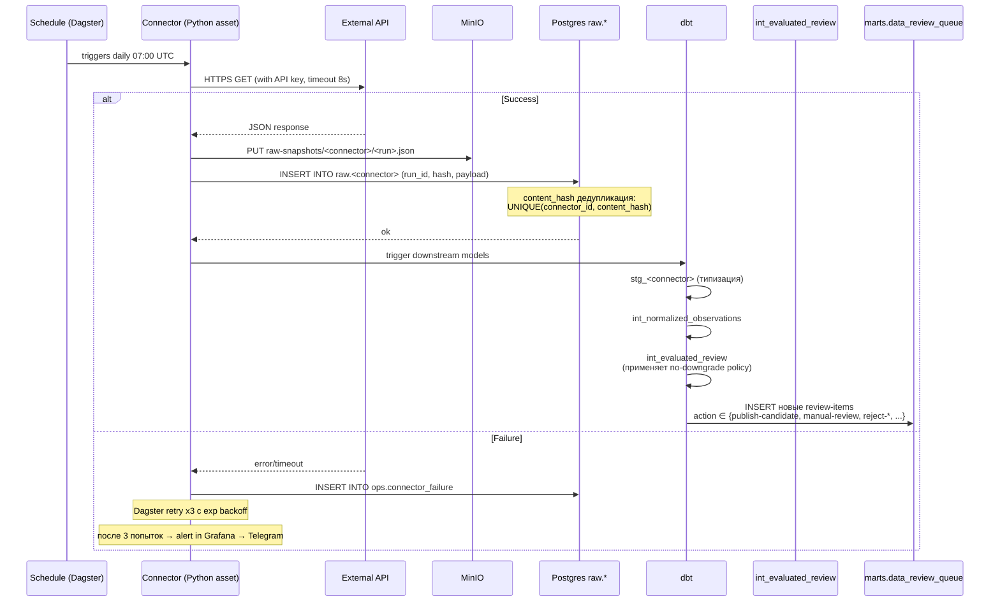
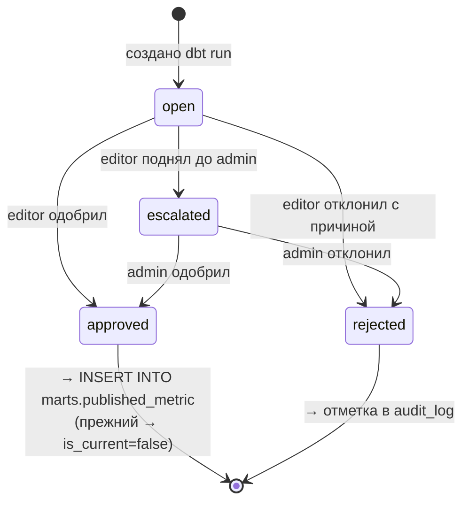

# Потоки данных и governance

## Главный принцип

> [!important] Никакая цифра в UI не появилась без аудиторского следа
> Каждое значение в `marts.published_metric` ссылается на конкретный `raw_source_snapshot`, прошедший `data_review_queue`, утверждённый известным пользователем (или `static-source-registry` для seed). От значения в карточке KPI можно за 3 клика дойти до исходного JSON ответа Census.

---

## Слои хранения

```
┌──────────────────────────────────────────────────────────────────┐
│  Источники: Census · BEA · EXIM · WB · ForeignAssistance ·       │
│             XLSX-файлы · Внутренние ведомственные системы        │
└────────────────────────────┬─────────────────────────────────────┘
                             ▼
┌──────────────────────────────────────────────────────────────────┐
│  LANDING (MinIO bucket raw-snapshots)                             │
│  Сырые ответы как пришли. Immutable. Хранение 7 лет.              │
│  Имя: <connector_id>/<yyyy>/<mm>/<dd>/<run_id>-<hash>.json        │
└────────────────────────────┬─────────────────────────────────────┘
                             ▼
┌──────────────────────────────────────────────────────────────────┐
│  raw.* (Postgres JSONB)                                            │
│  Метаданные snapshot (run_id, fetched_at, hash, payload jsonb)    │
│  Назначение: позволяет dbt трансформировать без обращения к S3    │
│  Загрузка: Dagster asset → INSERT INTO raw.<connector>            │
└────────────────────────────┬─────────────────────────────────────┘
                             ▼
┌──────────────────────────────────────────────────────────────────┐
│  staging.* (типизированно, dbt models, transient)                  │
│  stg_census__monthly, stg_worldbank__indicators, ...              │
│  → Pydantic-совместимая структура NormalizedObservation           │
└────────────────────────────┬─────────────────────────────────────┘
                             ▼
┌──────────────────────────────────────────────────────────────────┐
│  intermediate.*                                                    │
│  int_normalized_observations  — единая нормализация               │
│  int_evaluated_review         — применение политики (no-downgrade)│
└────────────────────────────┬─────────────────────────────────────┘
                             ▼
┌──────────────────────────────────────────────────────────────────┐
│  marts.* (стабильные витрины)                                      │
│  published_metric          — ТЕКУЩИЕ утверждённые                 │
│  published_metric_history  — все версии (dbt snapshot)            │
│  data_review_queue         — кандидаты на публикацию              │
│  domain_aggregates/*       — агрегаты для UI (KPI, рейтинги)      │
└──────────┬───────────────────────────────────────┬───────────────┘
           ▼                                       ▼
   ┌──────────────┐                        ┌────────────────┐
   │  FastAPI     │                        │   Superset     │
   │  /data/*     │                        │   read-only    │
   └──────────────┘                        └────────────────┘
           │
           ▼
   ┌──────────────┐
   │  Next.js UI  │
   └──────────────┘
```

См. визуально [[diagrams/data-lineage]] и [[diagrams/uml-data-model]].

---

## Контракты между слоями

### NormalizedObservation (между ingestion и dbt)

Pydantic-модель, переезжает из [lib/data-governance/types.ts](../../lib/data-governance/types.ts) практически 1-в-1:

```python
class NormalizedObservation(BaseModel):
    connector_id: str
    source_id: str
    metric_key: str           # стабильный ключ "trade.us.goods.monthly.exports"
    label: str
    domain: MetricDomain      # enum: trade|macro|assistance|finance|mobility|education|security|operations
    value: float | str | bool
    unit: str
    period_start: date
    period_end: date
    dimensions: dict[str, str | int | bool]
    source_url: AnyUrl | None
    source_published_at: date | None
    fetched_at: datetime
    is_preliminary: bool = False
    relevance_score: float = Field(ge=0, le=1)
    recommended_use: str
    quality_flags: list[str] = []
```

**Обязательное соответствие**: `metric_identity = metric_key + "::" + sorted(dimensions)` — это ключ для no-downgrade-сравнения.

### PublishedMetric (опубликованная версия)

Расширяет NormalizedObservation:

```python
class PublishedMetric(NormalizedObservation):
    id: str
    approved_at: datetime
    approved_by: UUID         # FK auth.app_user.id ИЛИ магическое 'static-source-registry'
    revision_id: str          # уникальный per (metric_identity, period_end)
    is_current: bool          # ровно один TRUE per metric_identity
```

---

## Ingestion · BPMN

> [!info] Диаграмма
> Полная BPMN: [[diagrams/bpmn-ingestion]]



### Жёсткие правила ingestion

| Правило                                                          | Где реализовано                       | Тест                              |
| ---------------------------------------------------------------- | ------------------------------------- | --------------------------------- |
| Snapshot всегда сохраняется в MinIO **до** парсинга              | Dagster asset                         | контракт Dagster IO manager       |
| Дубликат по `content_hash` пропускается                          | UNIQUE constraint в `raw.<connector>` | upsert с `on_conflict do nothing` |
| Любая ошибка коннектора → alert + auto-retry x3                  | Dagster retry policy                  | unit test                         |
| Нет частичных результатов (либо все observations, либо ни одной) | Транзакция в insert                   | integration test                  |
| API-key никогда не пишется в логи                                | OTel processor `attribute filter`     | review                            |
| Outbound traffic только на allowlisted FQDN                      | Egress proxy (squid)                  | infra test                        |

---

## No-downgrade policy

> [!important] Незыблемое правило
> Старший период не может заменить более новый утверждённый. Источник: [lib/data-governance/policy.ts:101](../../lib/data-governance/policy.ts#L101). В TO-BE переезжает в **dbt SQL test**.

### Алгоритм оценки кандидата

Псевдокод (полная реализация в `int_evaluated_review.sql`):

```python
def evaluate(candidate: NormalizedObservation, current: PublishedMetric | None, policy: SourceVersionPolicy):
    # 1) Валидация значения
    if not is_valid_value(candidate.value):
        return ReviewItem(action="reject-invalid", severity="block")

    # 2) Релевантность
    if candidate.relevance_score < policy.min_relevance_score:
        return ReviewItem(action="ignore-irrelevant", severity="info")

    # 3) Нет baseline → manual review
    if current is None:
        return ReviewItem(action="manual-review", severity="watch")

    # 4) КРИТИЧНО: старший период
    if candidate.period_end < current.period_end:
        return ReviewItem(
            action="reject-older-period",
            severity="block",
            reason="Approved value must not be downgraded"
        )

    # 5) Тот же период, то же значение → дубликат
    if candidate.period_end == current.period_end and values_match(candidate, current):
        return ReviewItem(action="duplicate-current", severity="info")

    # 6) Тот же период, новое значение → manual review (источник пересмотрен)
    if candidate.period_end == current.period_end:
        return ReviewItem(action="manual-review", severity="watch")

    # 7) Новый период
    if policy.replace_rule == "manual-only" or not policy.allow_auto_publish:
        return ReviewItem(action="manual-review", severity="watch")

    # 8) Прошли все проверки и автопубликация разрешена
    return ReviewItem(action="publish-candidate", severity="watch")
```

### dbt test

```yaml
# models/marts/schema.yml
version: 2
models:
  - name: published_metric
    tests:
      - unique:
          column_name: "metric_identity || '::' || period_end"
          where: "is_current = true"
      - dbt_utils.expression_is_true:
          name: no_downgrade_check
          expression: "period_end >= (select max(period_end) from {{ this }} t2 where t2.metric_identity = published_metric.metric_identity and t2.is_current = false)"
```

CI запускает `dbt test` → если тест упал, merge в main блокируется.

---

## Publication review · BPMN

> [!info] Диаграмма
> [[diagrams/bpmn-publication]]

Когда `int_evaluated_review` создал кандидат с `action='publish-candidate'` или `manual-review`, он попадает в `marts.data_review_queue`. Дальше — человеческий workflow:



### Detailed flow

1. **Editor открывает** `/admin/review-queue` → видит таблицу с `severity=block` сверху, `watch` ниже, `info` свернуто.
2. Для каждого item видит:
   - текущее значение (`current.value`) и кандидат (`observation.value`),
   - дельту в %,
   - историю предыдущих ревизий по этому `metric_identity`,
   - source URL для ручной проверки на сайте Census/BEA/WB,
   - `recommended_use` и `quality_flags`.
3. Действия:
   - **Approve** → backend в транзакции:
     ```sql
     UPDATE marts.published_metric SET is_current = false WHERE metric_identity = $1 AND is_current = true;
     INSERT INTO marts.published_metric (...) VALUES (...);
     INSERT INTO ops.audit_log (...);
     UPDATE marts.data_review_queue SET status='approved', reviewer_id=$2, reviewed_at=now();
     ```
   - **Reject** → отмечается в `data_review_queue.status='rejected'` с обязательным `reviewer_note`.
   - **Escalate** → уведомление admin через Telegram-bot, status=`escalated`.

> [!warning] Защита от ошибки
> Approve действительно меняет видимое значение в KPI карточке Президента. Поэтому:
>
> - Подтверждение через MFA push (повторное TOTP).
> - 5-минутное окно «откат» (immediately undo) — кнопка в audit-log странице.
> - При большой дельте (>50%) — обязательное ввод `reviewer_note` ≥ 30 символов.

---

## Static fallback (graceful degradation)

> [!note] Принцип
> Public-страницы дашборда должны рендериться **даже если БД лежит**. Отказ от этой стратегии = единая точка отказа в день большого визита.

### Реализация

```python
# fastapi-gateway/app/api/v1/data.py
async def get_latest(domain: str):
    try:
        async with timeout(0.5):
            return await db.fetch_published_metric_current(domain)
    except (DatabaseError, TimeoutError):
        log.warning("DWH unavailable, serving static fallback", extra={"domain": domain})
        return STATIC_FALLBACK[domain]   # bundled snapshot
```

### Static fallback origin

- При каждом dbt run с `target=prod` → `dbt run --select published_metric+` → `dbt-export-snapshot` запускает доп. шаг, выгружающий `published_metric` в JSON в MinIO bucket `static-fallback`.
- FastAPI при старте загружает это в memory.
- Refresh раз в час.

### Тестирование DR

Раз в месяц: `kubectl scale deployment postgres-primary --replicas=0` → проверяем, что UI остаётся читаемым (с явным баннером «данные могут быть устаревшими»).

---

## Lineage и observability данных

### dbt docs

`dbt docs generate && dbt docs serve` — публикует:

- DAG моделей (raw → staging → marts)
- Описание каждой колонки (из `schema.yml`)
- Свежесть (`source freshness`)

Хостится на `https://dbt-docs.uzus.local`, доступ по Keycloak SSO для analyst+.

### Dagster lineage UI

Asset graph + run history. Каждый asset показывает:

- последний successful materialization,
- размер snapshot (rows + bytes),
- автоматические quality checks.

### Свежесть данных в UI

Каждый KPI в Next.js видит badge:

- 🟢 свежие (< 24 часа от ожидаемого cadence)
- 🟡 устаревают (1–3x cadence)
- 🔴 устарели (> 3x cadence) + alert админу

Источник информации: `marts.published_metric.source_published_at` + `policy.cadence`.

---

## Удаление и retention

| Слой                               | Retention                                | Триггер                         |
| ---------------------------------- | ---------------------------------------- | ------------------------------- |
| MinIO `raw-snapshots`              | 7 лет                                    | lifecycle rule                  |
| `raw.*` (Postgres)                 | 1 год                                    | nightly cleanup                 |
| `staging.*`                        | transient (пересоздаётся каждый dbt run) | —                               |
| `intermediate.*`                   | transient                                | —                               |
| `marts.published_metric`           | бесконечно                               | history через snapshot          |
| `marts.published_metric_history`   | 7 лет                                    | dbt snapshot lifecycle          |
| `marts.data_review_queue` (closed) | 3 года                                   | nightly archive                 |
| `ops.audit_log`                    | 7 лет                                    | WORM, не удаляется до retention |
| `ops.user_preferences`             | вместе с user                            | каскад при удалении user        |
| Sentry events                      | 90 дней                                  | retention                       |
| Logs (Loki)                        | 30 дней горячее, 365 холодное            | retention                       |

---

## Безопасность данных

| Угроза                                                | Контрмера                                                                                                  |
| ----------------------------------------------------- | ---------------------------------------------------------------------------------------------------------- |
| Утечка через сервис-аккаунт DWH                       | Postgres pgAudit + alert при чтении > N rows за минуту                                                     |
| Доступ к raw данным в обход policy                    | RLS на `marts.*`, и `raw.*` доступен только сервис-роли `dbt_runner`                                       |
| Подделка audit-log                                    | Ed25519 подпись каждой записи + цепочка hash (Merkle) с ежедневным якорем                                  |
| Случайное удаление в DWH                              | Нет права DELETE у app users; только DBA через emergency procedure с two-man rule                          |
| MITM в outbound                                       | TLS 1.2+ обязательно, mTLS если поддерживается источником                                                  |
| API-key утечка в логах                                | OTel processor `attribute filter` маскирует `*key*`, `*secret*`                                            |
| Prompt injection через AI-чат на корпоративные данные | Server-side фильтр запрещает запросы про domain ∉ user.domains; output validation на ссылки в external URL |

---

## Дальше

- BPMN ingestion → [[diagrams/bpmn-ingestion]]
- BPMN publication → [[diagrams/bpmn-publication]]
- Lineage визуально → [[diagrams/data-lineage]]
- UML модели → [[diagrams/uml-data-model]]
- Workflow commitment'ов → [[06-business-processes]]
