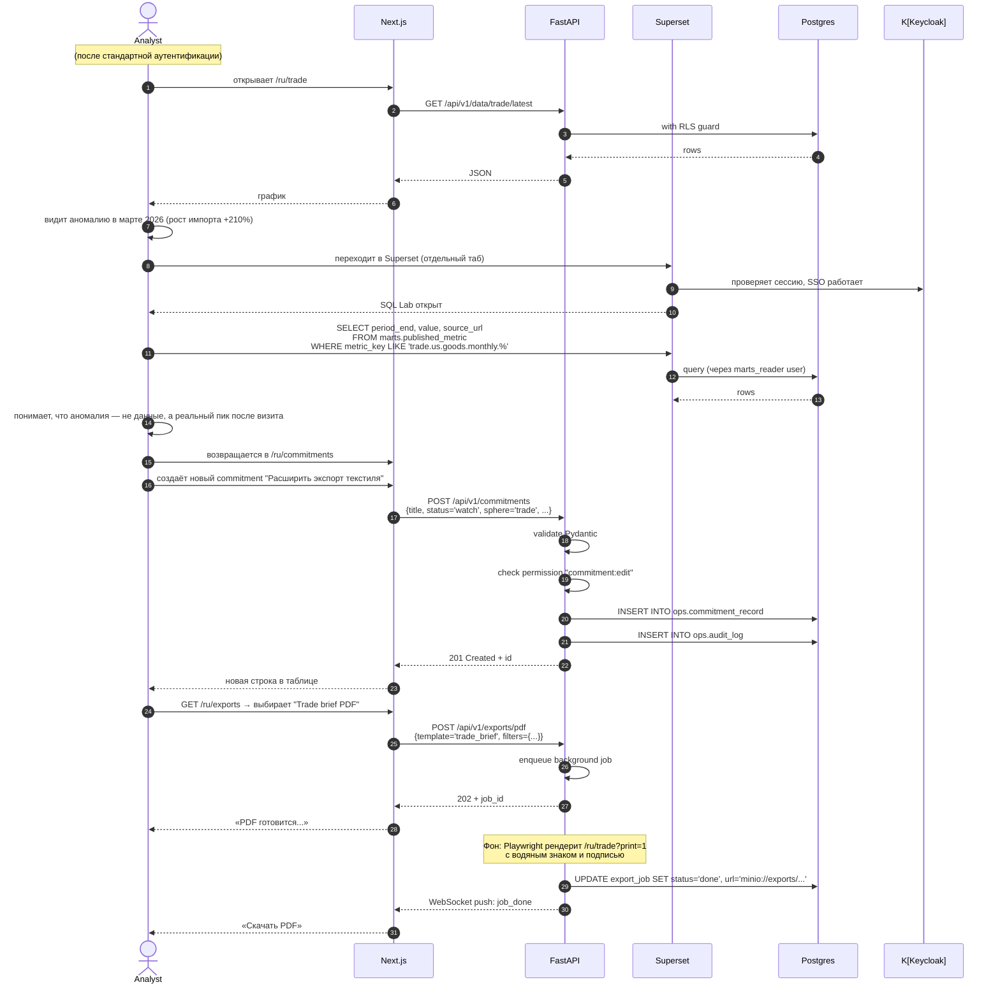
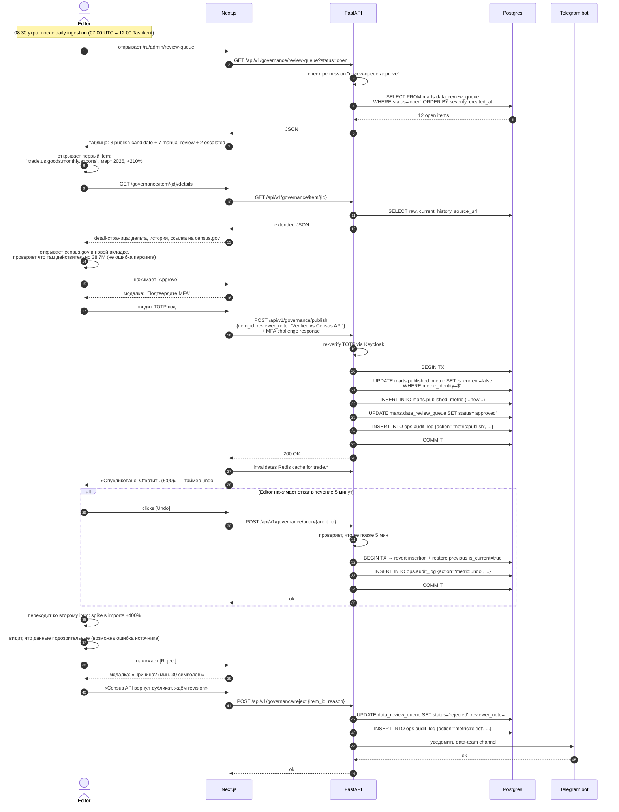
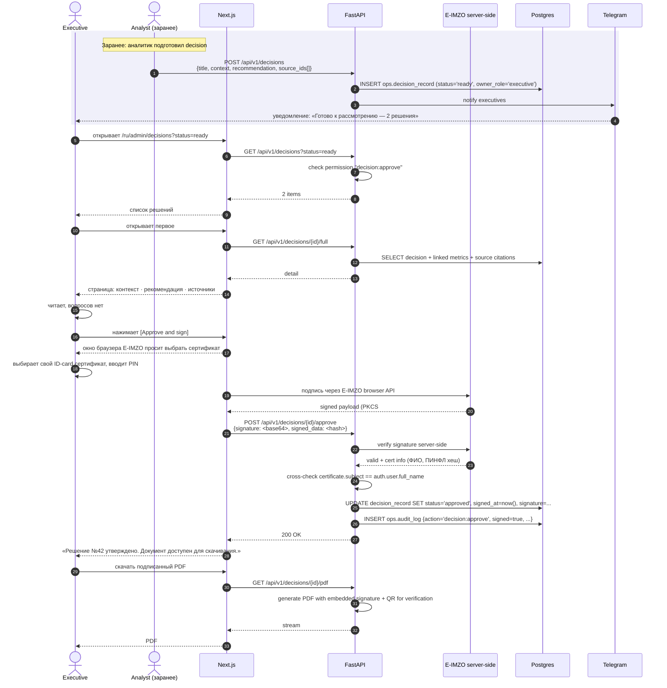
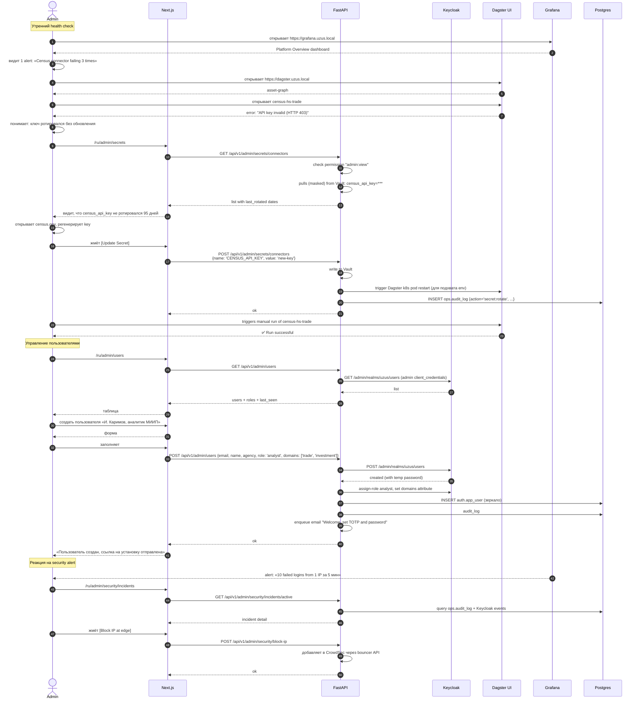

# Пути пользователей

> [!info] Назначение
> Полный сценарный путь каждой роли — от стандартной аутентификации до выполнения целевой задачи. Используется при UX-дизайне, написании автотестов, тренинге пользователей.

## Обзор ролей

| Роль | Главная задача | Частота входа | Устройство |
|---|---|---|---|
| **Viewer** | Прочитать KPI, открыть дашборд утром | 1–3 раза в день | Десктоп / iPad |
| **Analyst** | Подготовить набор данных для брифа | Ежедневно, 4–6 ч | Десктоп |
| **Editor** | Утвердить новые метрики после ingestion | 1 раз в день | Десктоп |
| **Executive** | Просмотр + одобрить решение | 1–2 раза в день | Десктоп / телефон |
| **Admin** | Управление платформой, инциденты | По мере надобности | Десктоп |

---

## 1. Viewer · стандартный путь

> **Персона**: Сотрудник Аппарата Президента, открывает утренний бриф.
> **Цель**: Увидеть свежие KPI по торговле, ближайшие визиты и сигналы рисков.

### Sequence (стандартный логин)

```mermaid
sequenceDiagram
  autonumber
  actor V as Viewer
  participant Br as Browser
  participant N as Next.js UI
  participant K as Keycloak
  participant F as FastAPI
  participant DB as Postgres

  V->>Br: открывает https://uzus.gov.uz
  Br->>N: GET /
  N-->>Br: 302 → /ru (по Accept-Language)
  Br->>N: GET /ru
  N->>N: проверяет session cookie
  N-->>Br: 302 → /api/auth/signin?provider=keycloak

  Br->>K: GET /realms/uzus/protocol/openid-connect/auth
  K-->>Br: страница логина (русский)
  V->>Br: вводит зулькарнаев@xxx.uz + пароль
  Br->>K: POST credentials
  K-->>Br: запрос TOTP (если MFA настроена)
  V->>Br: вводит 6 цифр из приложения
  Br->>K: POST otp
  K-->>Br: 302 → /api/auth/callback?code=...

  Br->>N: callback
  N->>K: exchange code → tokens
  K-->>N: access_token + refresh_token + id_token
  N->>F: GET /api/v1/users/me<br/>(подтянуть preferences)
  F->>DB: SELECT * FROM ops.user_preferences WHERE user_id=$1
  DB-->>F: theme=light, hide_demo=false
  F-->>N: preferences JSON
  N->>N: кладёт session_id в HttpOnly cookie

  N-->>Br: 302 → /ru
  Br->>N: GET /ru (с session)

  par Параллельная загрузка данных
    N->>F: GET /api/v1/data/trade/latest
    F->>DB: SELECT FROM marts.published_metric<br/>WHERE domain='trade' AND is_current=true
    DB-->>F: rows (RLS-фильтр: viewer.domains)
    F-->>N: JSON
  and
    N->>F: GET /api/v1/visits/horizon?days=90
    F->>DB: SELECT FROM marts.upcoming_visits
    DB-->>F: rows
    F-->>N: JSON
  and
    N->>F: GET /api/v1/risks/aggregated
    F-->>N: JSON
  end

  N-->>Br: HTML главной с KPI, картой, горизонтом
  V->>Br: листает, кликает KPI
  Br->>N: GET /ru/trade?direction=imports
  Note over Br,F: Следующие переходы — через server components<br/>и клиентский router; токен в каждом запросе
```

См. визуально: [[diagrams/journey-viewer]]

### Что Viewer видит и может

| Зона | Доступ |
|---|---|
| Главная (`/[locale]`) | ✅ Все KPI, картa, горизонт визитов, сигналы |
| `/[locale]/trade` | ✅ Все графики, фильтры |
| `/[locale]/visits`, `/agreements`, `/grants` | ✅ Чтение, экспорт PDF |
| `/[locale]/counterparts/[id]` | ✅ Брифинг-карты |
| `/[locale]/assistant` | ✅ AI-чат (rate-limit 20 запросов / час) |
| `/[locale]/admin` | ❌ 403, кнопка скрыта в UI |
| Изменение настроек | ✅ Только UI prefs (theme, language) |

### Тонкие места для viewer

- При первом логине пустой `user_preferences` → дефолты (theme=light, hide_demo=false)
- При федерализованной учётке (LDAP) первая сессия дольше на ~500 мс — Keycloak ходит в AD
- Если AI quota исчерпана → UI показывает «Превышен лимит, сбросится через 27 минут» (не 503)

---

## 2. Analyst · ежедневная работа с данными

> **Персона**: Аналитик Центра, готовит данные для брифа советника.
> **Цель**: Найти аномалию в торговле, добавить commitment, сделать выгрузку для коллеги.

### Стандартный путь



### Что Analyst может дополнительно к Viewer

| Действие | Где |
|---|---|
| Создать/редактировать commitment | `/admin/commitments` (subset admin UI) |
| Создать draft decision | `/admin/decisions/new` |
| Доступ в Superset SQL Lab | `https://superset.uzus.local` |
| Подключиться к коннектору в Superset | только marts.* read-only |
| Создать сохранённый чарт | в Superset |
| Скачать выгрузку CSV/XLSX | через FastAPI или Superset |

### Тонкие места для analyst

- Superset и Next.js — отдельные UI; user может запутаться где что искать. Решение: ссылка из каждого мартового KPI «Open in Superset» через deeplink.
- SQL Lab имеет квоту по строкам (max 50K) — больше → выгрузка как async job
- Если Analyst видит раздел `/admin/commitments`, но не имеет permission `metric:publish` — действия по утверждению метрик скрыты UI и заблокированы FastAPI (defence in depth).

---

## 3. Editor · утверждение метрик

> **Персона**: Редактор данных, отвечает за корректность торговой статистики.
> **Цель**: Утром после ingestion-cron'а просмотреть очередь обзора и одобрить/отклонить новые значения.

### Утренний review-цикл



### Эскалация

Если editor сомневается, вместо approve/reject он жмёт **[Escalate]** → `status='escalated'` → admin получает Telegram-нотификацию + видит в своей очереди.

### Тонкие места для editor

- 5-минутное окно undo — после этого нужна формальная процедура «отзыв публикации» через admin
- Для **block-severity** items (например, `reject-older-period`) кнопка Approve физически отсутствует — нельзя обойти политику кнопкой
- При большой дельте (>50%) reviewer_note обязателен ≥ 30 символов
- Если за 5 секунд после approve не пришло уведомление от FastAPI → UI запрашивает статус (защита от двойного approve)

---

## 4. Executive · утверждение решений

> **Персона**: Министр / Советник Президента.
> **Цель**: Просмотреть подготовленные аналитиками решения, одобрить/отклонить с цифровой подписью.

### Workflow одобрения decision



### Что Executive дополнительно может

| Действие | Особенность |
|---|---|
| Подписать решение | E-IMZO обязательно (физический USB-токен или SIM-карта) |
| Комментировать | Комментарии видят только executive + admin |
| Настроить уведомления | Telegram / email per event-type |
| Видеть аудит **своих** действий | Личный лог |

### Тонкие места для executive

- E-IMZO работает только в Chrome/Firefox с установленным client-side helper. На iPad — не работает → подписание только с десктопа.
- Если в момент подписи Keycloak session истекла → re-login + re-MFA
- При rejecting decision требуется reason ≥ 50 символов (для аудита)

---

## 5. Admin · управление платформой

> **Персона**: Системный администратор.
> **Цель**: Управлять пользователями, политиками источников, реагировать на инциденты.

### Типичный день admin



См. визуально: [[diagrams/journey-admin]]

### Зоны admin-доступа

| Раздел | Что доступно |
|---|---|
| `/admin` (главная) | сводка инцидентов, статус сервисов, демо-флаги |
| `/admin/users` | CRUD users, role assignment, force logout, сброс TOTP |
| `/admin/policies` | CRUD `source_version_policy`, demo registry |
| `/admin/secrets` | ротация секретов через Vault (без раскрытия значений) |
| `/admin/ingestion` | список runs, ручной trigger, статус коннекторов |
| `/admin/audit` | полный лог + фильтры + экспорт |
| `/admin/security` | failed logins, blocked IPs, AI quota breaches |
| `/admin/maintenance` | включить maintenance mode, force cache invalidation |
| Прямой доступ в Keycloak Admin | для emergency, через bookmark |
| Прямой доступ в Grafana / Dagster / Sentry | через SSO |
| Доступ в Postgres | только через bastion + 2FA + audit (`pgAudit`) |

### Тонкие места для admin

- Прямой доступ к Postgres — за bastion-узлом с дополнительным MFA. Каждое подключение → запись в `ops.audit_log` через pgAudit.
- При создании пользователя email отправляется через SMTP-relay Центра (не Vercel/Sendgrid)
- Force-logout не разрывает уже открытые WebSocket-соединения мгновенно — следующее API-сообщение приведёт к 401 → reconnect
- Nuclear option «выключить platform» — admin может включить maintenance mode → весь UI показывает страницу «технические работы», только admin-routes доступны

---

## Cross-cutting: что одинаково для всех

### Стандартная аутентификация (унифицированная)

См. детальный sequence: [[diagrams/auth-sequence]] и [[03-authentication-rbac#Authorization Code Flow с PKCE]].

**Базовый поток**:
1. Запрос ресурса → нет session → редирект на Keycloak
2. Логин (federated или local) + MFA если применимо
3. Code exchange → tokens → server-side session
4. RBAC + ABAC проверки на каждом API-запросе
5. Audit-log на каждое state-changing действие

### Logout

Любая роль:
- Инициирует через UI «Выйти» → Next-auth уничтожает session → Keycloak SLO (single logout) → все вкладки получают `auth-required` next request.

### Сессия истекла

- При истечении access_token (15 мин) Next-auth прозрачно делает refresh.
- При истечении refresh_token (8 часов) → next request 401 → редирект на login.

### Maintenance mode

- Admin включает → все non-admin запросы получают 503 + страница «Технические работы до 14:00».
- Admin может ходить через специальный header `X-Admin-Bypass: <vault-secret>`.

---

## Дальше

- Sequence-диаграмма стандартного логина → [[diagrams/auth-sequence]]
- Sequence-диаграмма Viewer → [[diagrams/journey-viewer]]
- Sequence-диаграмма Admin → [[diagrams/journey-admin]]
- BPMN бизнес-процессов → [[06-business-processes]]
