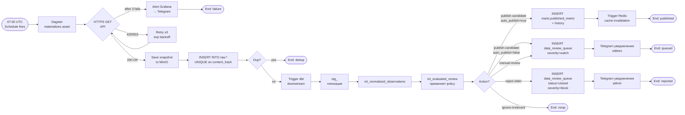
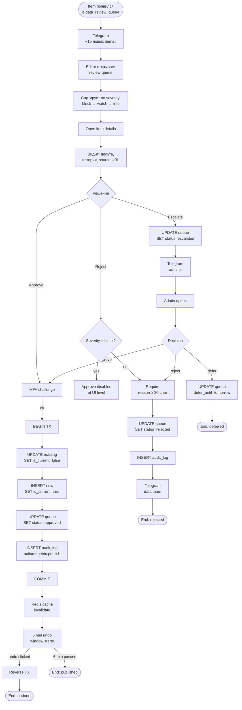
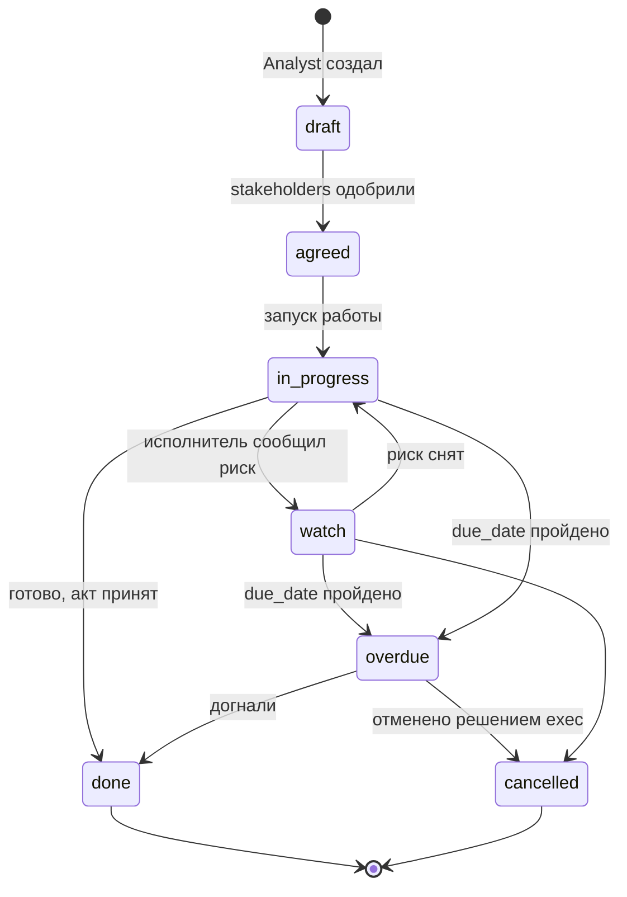
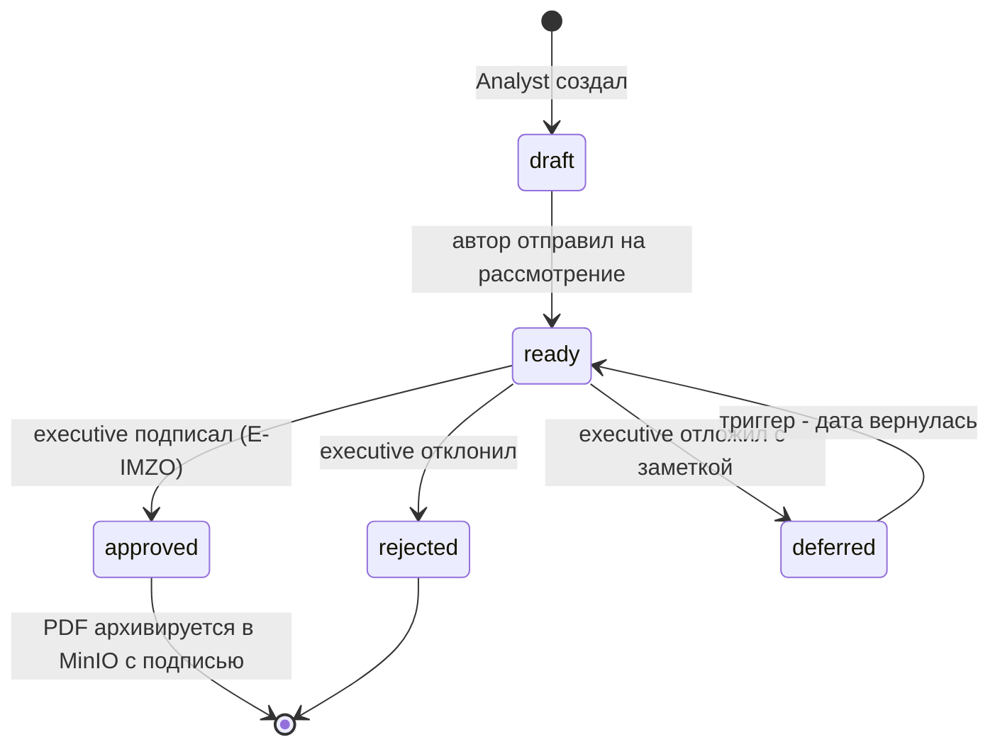
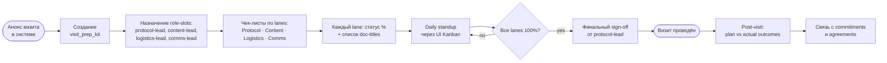
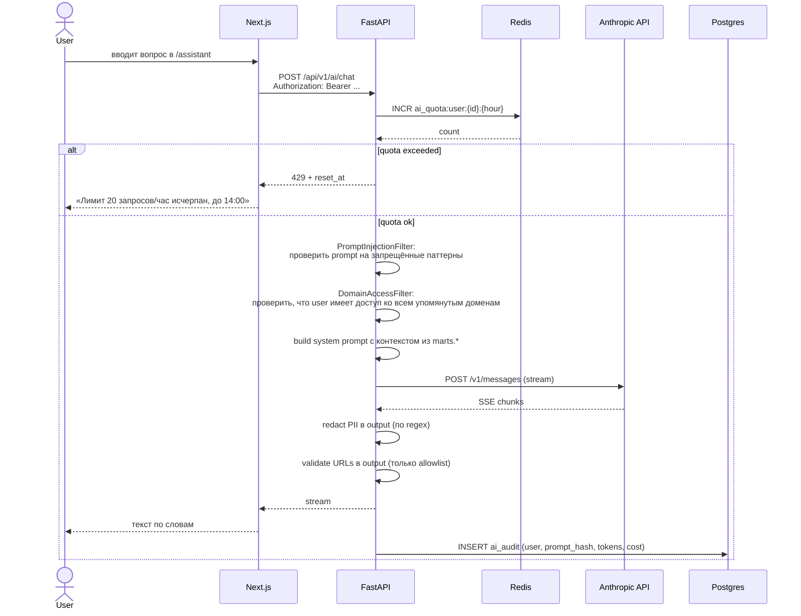
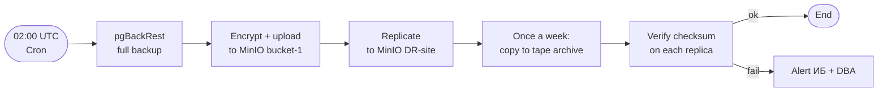
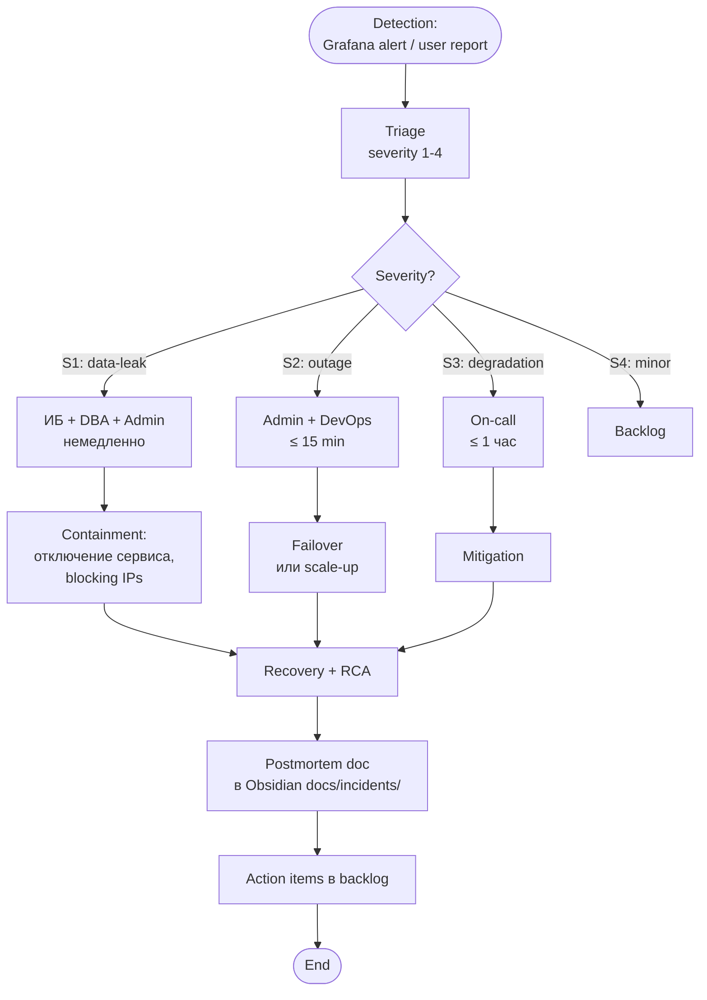

# Бизнес-процессы

> [!info] Что здесь
> Каждый ключевой кросс-функциональный процесс описан как BPMN: участники, события, шаги, шлюзы, исключения. Визуальная BPMN-нотация — в `.drawio` файлах.

---

## 1. Ingestion внешних источников

> [!info] Диаграмма
> [[diagrams/bpmn-ingestion]]

### Действующие лица (lanes)

| Lane | Роль |
|---|---|
| Dagster Scheduler | автомат |
| Connector | автомат (Python) |
| MinIO | хранилище |
| Postgres `raw.*` | БД |
| dbt | автомат |
| Editor | человек |
| Notification (Telegram) | автомат |

### Поток

### Гарантии

- **At-least-once**: при сбое Dagster повторит. Дедупликация по `content_hash` в БД.
- **Идемпотентность**: повторный run с тем же snapshot → no-op.
- **Транзакционность**: snapshot + INSERT в одной транзакции; либо весь run прошёл, либо ничего.
- **Атомарность смены `is_current`**: переключение текущей метрики в одной транзакции (старая → false, новая вставляется).

### Исключения

| Сценарий | Реакция |
|---|---|
| API недоступен 5 минут | Retry x3 → alert; следующий run по расписанию |
| API key истёк | Alert «secret rotation needed» → admin в [[05-user-journeys#5. Admin]] |
| Источник вернул мусор (parsing error) | Snapshot всё равно сохраняется; в `staging` не доедет; `quality_flags=['parse-error']` |
| Постгрес лежит | Dagster ставит run в `failed`, retry через 10 мин; данные в MinIO живы → можно реплейнуть |
| dbt тест упал | run помечен failed; никаких записей в `marts.*` не появляется до фикса |

---

## 2. Publication review (утверждение метрик)

> [!info] Диаграмма
> [[diagrams/bpmn-publication]]

### Действующие лица

| Lane | Роль |
|---|---|
| Editor | человек |
| Admin (escalation) | человек |
| FastAPI | автомат |
| Postgres | БД |
| Audit log | автомат |
| Telegram | автомат |

### Поток

### Защитные механизмы

- **Two-eye rule** для high-impact: если изменение KPI > 50% или влияет на главную страницу → нужен **второй editor** для co-sign.
- **Cooldown**: повторное approve того же `metric_identity` блокируется на 1 минуту (защита от двойного клика).
- **Audit trail**: каждый approve/reject/escalate пишется в WORM-лог, подписывается.

---

## 3. Commitment lifecycle

> [!info] Диаграмма
> [[diagrams/bpmn-commitment]]

### Состояния

### Жизненный цикл

| Событие | Кто инициирует | Что происходит |
|---|---|---|
| Создание (`draft`) | analyst, editor | INSERT `commitment_record`, audit |
| Согласование (`agreed`) | editor + executive co-sign | UPDATE status, audit |
| В работе (`in_progress`) | owner | UPDATE status, due_date обязательно |
| Сигнал риска (`watch`) | owner или система (за 7 дней до overdue) | UPDATE status, Telegram |
| Просрочено (`overdue`) | автомат | nightly job: WHERE due_date < today AND status NOT IN done/cancelled |
| Завершено (`done`) | owner + editor co-sign | UPDATE, audit, attach proof file (MinIO) |
| Отменено (`cancelled`) | executive | UPDATE + reason ≥ 50 char |

### Связи с остальной системой

- Каждый `commitment` может быть привязан к `visit_id` → отслеживание исполнения договорённостей визита.
- При просрочке → запись в `overview/Risk Radar` сигнал.
- При завершении со ссылкой на `agreement_id` → дополняет агригат на странице `/agreements`.

### Уведомления

| Событие | Канал | Получатели |
|---|---|---|
| Created | Email + Telegram | Все co-owners |
| Status changed | Telegram | Owner |
| 7 дней до overdue | Telegram + Email | Owner + co-owners |
| Overdue | Telegram + Email | Owner + executive домена |
| Done | Email | Все co-owners + executive |

---

## 4. Decision workflow

### Состояния

### Особенности

- В состоянии `ready` decision виден всем executives с правом по этому домену.
- Подпись в `approved` → **обязательно E-IMZO** (физический сертификат).
- После approval — мутирующие операции запрещены (immutable).
- Связь со списком `commitments` — decision может породить N commitments автоматически (если так настроен шаблон).

---

## 5. Visit-prep coordination

> [!warning] PII boundary
> См. жёсткое правило в [[../../CLAUDE]] и [[00-overview#Связанные сущности из CLAUDE.md]]. Этот процесс трекает **только статус**, не содержимое.

### Поток подготовки визита

### Что НЕ хранится (по жёсткому правилу)

- Номера паспортов, виз
- PNR, гостиничные брони
- Тексты talking points
- Тела MoU
- ФИО делегатов
- Личные контакты

Эти артефакты живут в **отдельной операционной системе** с полноценным authn/authz/document-storage и audit. Платформа знает только:
- статус % lane (по чеклисту)
- название документа (но не его текст)
- факт «бронирование сделано» (но не код)

---

## 6. AI assistant использование (с квотами)

---

## 7. Backup и восстановление

### Backup (автомат, ежедневно)

### Restore drill (квартально)

1. Admin триггерит restore-drill workflow.
2. Восстановление в staging-кластер из последнего бэкапа.
3. Сверка `marts.published_metric` count vs prod.
4. dbt-test полный прогон.
5. Документирование RTO/RPO в `docs/runbooks/restore-drill-{quarter}.md`.

---

## 8. Incident response

---

## Сводная карта процессов

| Процесс | Trigger | Длительность | Owner |
|---|---|---|---|
| Ingestion | Schedule (07:00 UTC) | < 10 мин | Data team |
| Publication review | Появление item в queue | < 4 ч SLA | Editor |
| Commitment lifecycle | Создание/событие | дни-месяцы | Owner + editor |
| Decision workflow | Готов к рассмотрению | < 24 ч SLA | Executive |
| Visit-prep | За N дней до визита | дни-недели | Protocol-lead |
| AI assistance | Per request | < 30 сек | n/a (per-user) |
| Backup | 02:00 UTC daily | < 30 мин | DevOps |
| Restore drill | Quarterly | 4 ч | DBA + DevOps |
| Incident response | Detection | по severity | On-call rotation |

---

## Дальше

- Узкие места и тупики в этих процессах → [[07-bottlenecks-and-risks]]
- Визуальные BPMN → [[diagrams/bpmn-ingestion]], [[diagrams/bpmn-publication]], [[diagrams/bpmn-commitment]]
