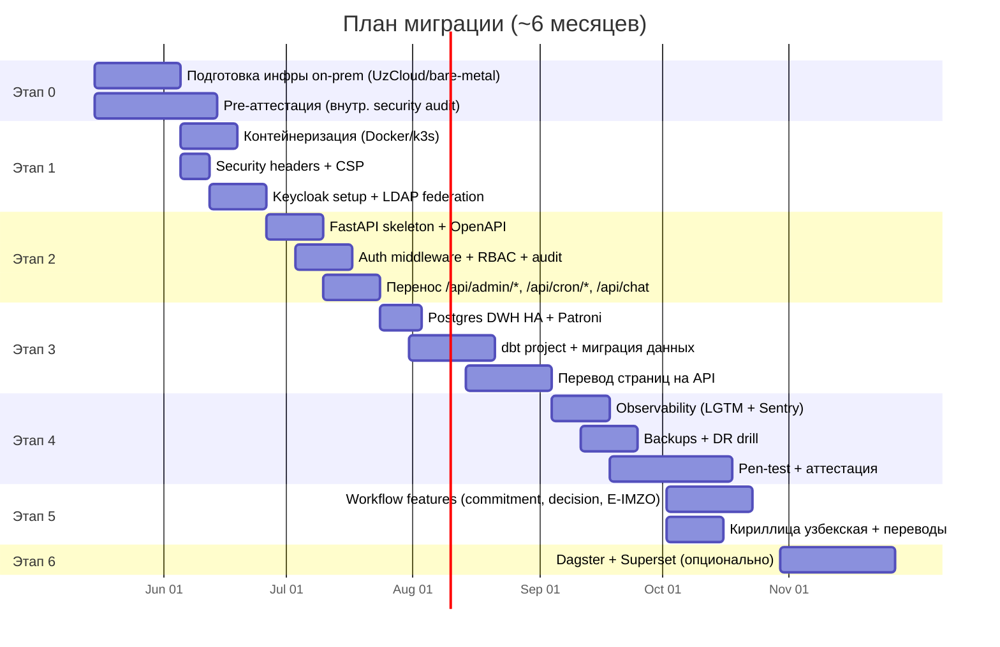

# План миграции AS-IS → TO-BE

> [!info] Принципы перехода
> 1. **Никакого big-bang**. Параллельная работа старого и нового, постепенный switch.
> 2. **Static fallback всегда жив**. Платформа должна быть хотя бы в read-only при любом этапе.
> 3. **Безопасность раньше функциональности**. Compliance, аудит, identity — впереди feature work.
> 4. **Каждый этап ≤ 1 месяца**. Длинные этапы скрывают регрессы.
> 5. **Контрольный demo каждый этап**. Заказчик видит progress.

---

## Прагматичный минимум

> [!tip] Если ресурсов меньше, чем нужно для full TO-BE
> Запустите **только** эти компоненты, остальные добавьте позже:
> - **FastAPI** (заменяет Next.js API routes, даёт OIDC, audit, RBAC)
> - **Postgres 17 + dbt** (DWH без оркестратора — APScheduler внутри FastAPI)
> - **Keycloak** (одна реплика для начала)
> - **MinIO** (1 узел)
> - **Next.js** (остаётся как есть)
> - **Sentry** + Loki (минимальная observability)
>
> Это даёт 80% enterprise-value на 50% усилий. Без Dagster, Superset, multi-replica.

---

## Этапы

---

## Этап 0 · Подготовка (2 недели до старта)

> [!warning] Без этого этапа дальше двигаться нельзя

### Решения до начала

- [ ] Утверждённый ЦОД (UzCloud / UZINFOCOM / bare-metal)
- [ ] DNS-зона `*.uzus.gov.uz` (или другое)
- [ ] TLS-сертификаты (Let's Encrypt или гос. УЦ)
- [ ] SMTP-relay для email-уведомлений
- [ ] Telegram-bot (для нотификаций) — заведён аккаунт через Center @uzus_situational_bot
- [ ] Создан пустой git repo для FastAPI (отдельный от текущего)
- [ ] Утверждена модель доступа (Single SSO vs federated)

### Pre-security audit

- [ ] Внешний security аудит существующего кода (SAST + DAST + manual review)
- [ ] Threat model по STRIDE для AS-IS
- [ ] Регистрация системы в УзСтандарт как «информационная система 2 категории»
- [ ] Подписан DPA с подрядчиками (если есть)

**Deliverable**: документ `docs/security/threat-model.md` + список найденных уязвимостей с deadlines.

---

## Этап 1 · Инфраструктура и базовая безопасность (3 недели)

### 1.1 Контейнеризация и развёртывание

- [ ] `Dockerfile` для текущего Next.js (multi-stage, distroless base)
- [ ] `docker-compose.yml` для local dev (next + postgres + minio + keycloak)
- [ ] k3s кластер на 3 узла в выбранном ЦОД
- [ ] Helm chart для Next.js (в репо `infra/helm/next-ui`)
- [ ] Traefik с TLS-termination + автообновление сертификатов
- [ ] Egress proxy (squid) с allowlist FQDN

**Acceptance**: текущий Next.js работает в k3s, доступен снаружи через Traefik с TLS.

### 1.2 Security headers + CSP

- [ ] CSP nonce-based в Next.js middleware
- [ ] HSTS + preload
- [ ] X-Frame-Options DENY
- [ ] Referrer-Policy strict-origin-when-cross-origin
- [ ] Permissions-Policy (отключить geolocation, camera, microphone)
- [ ] Cross-Origin-Opener-Policy same-origin
- [ ] Cross-Origin-Resource-Policy same-site

**Тест**: `curl -I https://uzus.gov.uz | grep -i 'content-security'` показывает все заголовки. Проверка через [securityheaders.com](https://securityheaders.com) → ≥ A.

### 1.3 Keycloak

- [ ] Keycloak 26 в k3s, отдельный Postgres
- [ ] Realm `uzus` с base config
- [ ] LDAP federation (если есть AD)
- [ ] Roles: viewer, analyst, editor, executive, admin
- [ ] Groups: dept-mid, dept-mipt, dept-aucc, dept-center
- [ ] MFA для editor+ обязательно
- [ ] Email relay настроен
- [ ] Realm export → MinIO ежедневно

**Acceptance**: один тестовый пользователь логинится через Keycloak в Next.js (next-auth с Keycloak provider).

### 1.4 Bring-down существующего ADMIN_PASSWORD

- [ ] После перевода на Keycloak — `ADMIN_PASSWORD` удаляется из env
- [ ] `lib/auth/admin.ts` удаляется
- [ ] Все маршруты `/admin/*` теперь идут через Keycloak SSO

**Deliverable**: текущий проект работает в k3s, аутентификация через Keycloak, security headers выполняются.

---

## Этап 2 · FastAPI Backend (5 недель)

### 2.1 Skeleton

- [ ] `fastapi-gateway` репозиторий + структура из [[02-component-catalog#fastapi-gateway]]
- [ ] CI: pytest + ruff + mypy + bandit
- [ ] OpenAPI 3.1 авто-генерация
- [ ] `openapi-typescript` в Next.js → `lib/api-types.ts` авто-обновляется

### 2.2 Auth middleware + audit

- [ ] JWT verification через JWKS (cached)
- [ ] RBAC guard `require_permission(...)`
- [ ] ABAC guard `require_domain(...)`
- [ ] WAL-style audit logger (без блокировки на write)
- [ ] Подпись audit-records (Ed25519, ключ в Vault)

### 2.3 Перенос existing endpoints

| AS-IS endpoint | TO-BE endpoint | Статус |
|---|---|---|
| `/api/chat` | `/api/v1/ai/chat` | port + rate-limit + redaction |
| `/api/admin/ingest/run` | `/api/v1/admin/ingestion/run` | port |
| `/api/admin/ingest/status` | `/api/v1/admin/ingestion/status` | port |
| `/api/cron/ingest` | `/api/v1/cron/ingest` (с `X-Internal-Token`) | port |
| `/api/data/*/latest` | `/api/v1/data/{domain}/latest` | port |
| `/api/live-data/*` | `/api/v1/live-data/*` | port |

**Acceptance**: Next.js полностью переключился на FastAPI; `app/api/*` остались только `auth/*` (next-auth callbacks).

---

## Этап 3 · DWH + dbt (7 недель)

### 3.1 Postgres HA

- [ ] Patroni 3 + etcd 3
- [ ] Primary + sync replica + 1 async replica
- [ ] pgBouncer transaction pool
- [ ] pgBackRest с MinIO destination
- [ ] pgAudit включён

### 3.2 Schema migration

- [ ] Существующая `database/schema.sql` → `alembic` миграции в FastAPI
- [ ] Добавить схемы: `raw`, `staging`, `marts`, `ops`, `auth`, `dbt`
- [ ] Заполнить `auth.app_user` синком из Keycloak
- [ ] Включить RLS политики

### 3.3 dbt project

- [ ] dbt-core 1.9 + dbt-postgres adapter
- [ ] Модели в [02-component-catalog#dbt-core](02-component-catalog.md#dbt-core)
- [ ] Тесты, замещающие `policy.ts`
- [ ] CI: `dbt run --target=ci && dbt test`
- [ ] Snapshot для `published_metric_history`

### 3.4 Миграция текущих data файлов в DWH

- [ ] Скрипт `migrate-static-to-dwh.py`: читает `data/*.ts` (через TS→JSON предкомпиляцию) → `marts.published_metric` с `approved_by='static-source-registry'`
- [ ] Запуск в staging, проверка count
- [ ] Запуск в prod (single shot)
- [ ] **Static fallback** в FastAPI: ровно эти данные читаются при недоступности БД → grace degradation

### 3.5 Перевод frontend страниц на API

- [ ] `/[locale]/page.tsx`: `import {tradeAnnual}` → `await fetchApi('/api/v1/data/trade/latest')`
- [ ] Постранично: trade, investments, grants, ...
- [ ] data/*.ts остаются для seed
- [ ] e2e тесты против обоих режимов (`DATA_BACKEND=static` и `DATA_BACKEND=dwh`)

**Acceptance**: dashboard работает на DWH; включение `DATA_BACKEND=static` оставляет static fallback.

---

## Этап 4 · Observability + Backup + аттестация (6 недель)

### 4.1 LGTM-stack

- [ ] OpenTelemetry collector в k3s
- [ ] Loki для логов
- [ ] Tempo для трасс
- [ ] Mimir / Prometheus для метрик
- [ ] Grafana с готовыми дашбордами
- [ ] Alertmanager → Telegram + email

### 4.2 Sentry self-hosted

- [ ] Sentry в k3s
- [ ] Frontend (Next.js) и FastAPI отправляют ошибки
- [ ] Source-maps загружаются из CI

### 4.3 Backup + DR

- [ ] Бэкапы 3-2-1 настроены и проверены
- [ ] Restore drill: восстановление в staging из вчерашнего бэкапа
- [ ] Documented RPO/RTO

### 4.4 Pen-test + аттестация

- [ ] Внешний pen-test (gray-box)
- [ ] Все critical/high уязвимости устранены
- [ ] Подача в CERT-UZ на аттестацию
- [ ] Документ «Threat model + DFD + control matrix» готов

**Acceptance**: получен сертификат CERT-UZ.

---

## Этап 5 · Operational features (3 недели)

### 5.1 Commitment lifecycle UI

- [ ] CRUD `/admin/commitments` с state machine
- [ ] Уведомления (Telegram + email) per event-type
- [ ] Связь с visits и agreements

### 5.2 Decision workflow + E-IMZO

- [ ] CRUD `/admin/decisions` с workflow
- [ ] Интеграция E-IMZO browser SDK
- [ ] Server-side подпись verify
- [ ] PDF export со встроенной подписью + QR

### 5.3 Кириллица узбекская

- [ ] Добавление locale `uz-cyrl` в next-intl
- [ ] Перевод 3 message-files (en/ru/uz-cyrl/uz-latn)
- [ ] Профессиональная редактура (Dilmoch / native review)

**Acceptance**: government users могут логиниться, видеть кириллицу, утверждать решения с цифровой подписью.

---

## Этап 6 · Зрелость (4 недели)

> [!note] Опционально
> Эти компоненты добавляются, когда подтверждена потребность. Можно отложить.

### 6.1 Dagster

- [ ] Dagster в k3s
- [ ] DAG'и для 5 коннекторов (миграция из APScheduler)
- [ ] Asset-graph + lineage UI

### 6.2 Superset

- [ ] Superset в k3s, OIDC через Keycloak
- [ ] Connection к `marts.*` через `marts_reader`
- [ ] Базовые dashboards для аналитиков
- [ ] Тренинг analyst-команды

### 6.3 Vault для секретов

- [ ] HashiCorp Vault HA
- [ ] K8s integration
- [ ] Миграция всех секретов из K8s secrets в Vault
- [ ] Авторотация ключей API

---

## Контрольные точки

| Веха | Критерий приёмки | Кто принимает |
|---|---|---|
| **M1: инфра готова** | k3s + Keycloak + Next.js работают on-prem | Tech Lead + ИБ |
| **M2: API split** | FastAPI обслуживает все мутирующие операции | Архитектор |
| **M3: data в DWH** | Все KPI приходят из `marts.published_metric` | Data team |
| **M4: аттестация** | Сертификат CERT-UZ получен | ИБ + юр. отдел |
| **M5: ops features** | Commitment + Decision + E-IMZO рабочие | Product |
| **M6: enterprise complete** | Dagster + Superset + Vault | Tech Lead |

---

## Риски миграции

| Риск | Вероятность | Митигация |
|---|---|---|
| Аттестация задерживается | M | Pre-аттестация на этапе 0 + buffer 1 месяц |
| Подрядчик ЦОД срывает SLA | M | Контракт с штрафами + параллельный fallback ЦОД |
| Команда не справляется с темпом | H | Прагматичный минимум, отказ от Dagster/Superset |
| API breaking change в Census/BEA | M | См. [[07-bottlenecks-and-risks#1.3]] |
| E-IMZO не работает в k3s pods (нативные libs) | L | Server-side verify через отдельный pod-helper |
| LDAP в АП не имеет нужных групп | M | Создание ролей через Keycloak local + ручной mapping |

---

## Откат (rollback strategy)

> [!important] Любой этап должен быть откатимым

- Этапы 1-2: feature flag в Next.js (`USE_LEGACY_AUTH`) — быстрый откат на HMAC-cookie
- Этап 3: `DATA_BACKEND=static` возвращает использование `data/*.ts`
- Этап 4: observability — без неё всё работает, можно отключить
- Этап 5: workflow features за feature flag
- Этап 6: опциональные сервисы — отключаются без влияния на ядро

---

## Бюджет (оценочно)

> [!warning] Не точный, требует уточнения у подрядчика

| Статья | Один раз (CapEx) | Ежемесячно (OpEx) |
|---|---|---|
| Hardware (3 узла k3s + 1 data) | $30K | — |
| Лицензии (все OSS) | $0 | $0 |
| ЦОД (UzCloud) | $5K (setup) | $1.5K |
| Pen-test + аттестация | $20K | — |
| Команда (3 человека × 6 мес) | — | $15K/мес → $90K |
| Внешние сервисы (Anthropic, OneID) | $0 | $0.5K |
| **Итого** | **$55K + $90K** | **~$2K/мес** |

---

## Дальше

- Глоссарий → [[09-glossary]]
- Каталог диаграмм → [[diagrams/README]]
