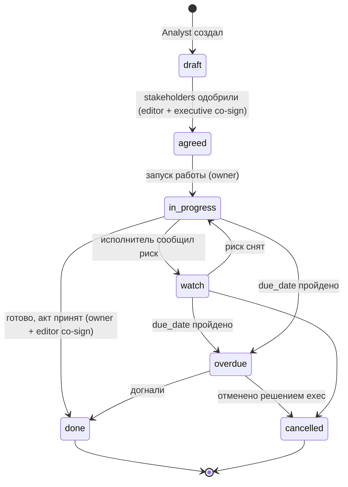
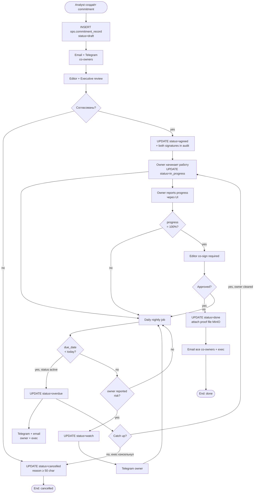

# BPMN · Commitment lifecycle

> [!info] Файл
> [`bpmn-commitment.drawio`](bpmn-commitment.drawio)

## Цель

Описать **жизненный цикл commitment** — обязательства, договорённости, чек-листа выполнения. От draft до done или cancelled. Используется при разработке UI и при определении SLA по конкретным обязательствам.

## State machine



## Inline mermaid · процесс



## Особенности

### Co-sign на критические переходы

| Переход | Кто подписывает |
|---|---|
| draft → agreed | editor + executive |
| in_progress → done | owner + editor |
| any → cancelled | executive (только) |

Co-sign реализован как **двух-шаговая процедура**: первый actor отмечает «готов», второй approve в течение 24 часов. После 24 ч — отменяется.

### Автоматический переход в `overdue`

Nightly job (Dagster sensor):
```sql
UPDATE ops.commitment_record
SET status = 'overdue'
WHERE due_date < CURRENT_DATE
  AND status NOT IN ('done', 'cancelled', 'overdue');
```

При переходе → Telegram + email.

### Уведомления

| Событие | Канал | Получатели |
|---|---|---|
| Created | Email + Telegram | All co-owners |
| Status changed | Telegram | Owner |
| 7 дней до overdue | Telegram + email | Owner + co-owners |
| Overdue | Telegram + email | Owner + executive домена |
| Done | Email | All co-owners + executive |
| Cancelled | Email | All co-owners + executive |

### Связи с остальной системой

- `commitment.linked_visit_id` → отслеживание исполнения договорённостей визита
- `commitment.value_musd` + `done` → дополняет агригат на `/agreements`
- При просрочке → запись в `Risk Radar` (overview page)

### PII boundary

> [!warning] Что НЕ хранится в commitment_record
> - Конкретные тексты документов
> - Финансовые подробности (только агрегат `value_musd`)
> - Личные данные исполнителей (только role-slot, не ФИО)
>
> Эти артефакты живут в отдельной операционной системе. См. [[../06-business-processes#5. Visit-prep coordination]].

## Связанные

- Полное описание процесса → [[../06-business-processes#3. Commitment lifecycle]]
- UML данных → [[uml-data-model]]
