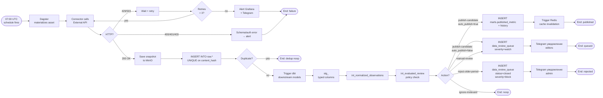

# BPMN · Ingestion внешних источников

> [!info] Файл
> [`bpmn-ingestion.drawio`](bpmn-ingestion.drawio)

## Цель

Описать процесс **получения данных из внешних API** и складирования в DWH с применением no-downgrade политики. BPMN показывает участников (lanes), события, шлюзы, исключения.

## Lanes

| Lane                   | Роль                              |
| ---------------------- | --------------------------------- |
| **Dagster scheduler**  | автомат, запускает по cron        |
| **Connector (Python)** | автомат, asset-материализация     |
| **External API**       | внешний сервис                    |
| **MinIO**              | хранилище                         |
| **Postgres raw.***     | БД                                |
| **dbt**                | автомат, трансформации            |
| **Editor**             | человек, при необходимости review |
| **Notification**       | автомат, Telegram + email         |

## Inline mermaid

## Правила и инварианты

### Идемпотентность

- Каждый `(connector_id, content_hash)` уникален → повторная загрузка одного снимка пропускается на уровне БД (`UNIQUE constraint`).
- Dagster retries не создают дубликатов.

### Атомарность

- `BEGIN TX → INSERT raw + INSERT staging via dbt → COMMIT`
- Если dbt падает после INSERT raw — следующий run перевычислит staging.

### Ограничения

| Параметр            | Значение                             |
| ------------------- | ------------------------------------ |
| Connector timeout   | 8 секунд                             |
| Retry count         | 3 (exponential backoff: 1s, 5s, 25s) |
| Dagster run timeout | 5 минут                              |
| Snapshot size limit | 10 MB (защита от runaway pull)       |

## Что происходит при ошибках

| Ошибка                        | Реакция                                                             |
| ----------------------------- | ------------------------------------------------------------------- |
| HTTP 429 (rate limit)         | Wait + retry (max 3)                                                |
| HTTP 503 (server unavailable) | Wait + retry                                                        |
| HTTP 401/403                  | Без retry, alert «secret rotation needed»                           |
| HTTP 400                      | Schema mismatch → Pydantic validation error → alert + manual review |
| Timeout                       | Считается как 503, retry                                            |
| Empty response                | quality_flag=`empty-response`, переходит в queue                    |
| Postgres connection refused   | Dagster retries; данные в MinIO живы                                |
| dbt test failure              | run fail; ничего в `marts.*` не появляется                          |

## Связанные

- Полное описание процесса → [[../06-business-processes#1. Ingestion внешних источников]]
- Data lineage → [[data-lineage]]
- BPMN publication → [[bpmn-publication]]
