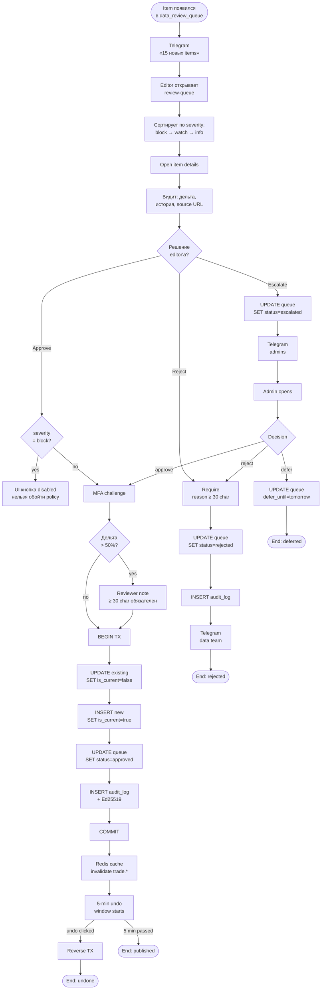

# BPMN · Publication review

> [!info] Файл
> [`bpmn-publication.drawio`](bpmn-publication.drawio)

## Цель

Описать **человеческий процесс утверждения метрик** после автоматической ingestion. Показывает: что делает editor, какие шаги защищены MFA, как работают undo/escalation.

## Lanes

| Lane | Роль |
|---|---|
| **Telegram bot** | автомат, нотификации |
| **Editor** | человек |
| **Admin** (escalation) | человек |
| **FastAPI** | автомат, валидация + транзакции |
| **Postgres** | БД |
| **Audit log** | автомат |

## Inline mermaid

## Ключевые защиты

### 1. block-severity — кнопка Approve физически отсутствует
Когда policy эмитит `reject-older-period` со `severity=block`, UI **не показывает Approve**. Это защита от случайного bypass через UI.

### 2. MFA challenge при approve
Каждое approve требует свежего TOTP. Защита от stolen session.

### 3. Reason ≥ 30 char при большой дельте
Если `|new - old| / old > 0.5` — обязательное поле reviewer_note ≥ 30 символов. Защита от ошибок «accidental approve».

### 4. 5-минутное окно undo
После approve включается таймер. Откатить публикацию можно одним кликом из audit-страницы. После 5 минут — формальная процедура «отзыв публикации».

### 5. Cooldown 1 минута на тот же `metric_identity`
Повторный approve того же metric_identity блокируется на 60 секунд. Защита от двойного клика / race condition.

### 6. Escalation
Если editor не уверен → escalate. admin получает Telegram, видит у себя в queue, может approve/reject/defer.

## SLA

| Метрика | Цель |
|---|---|
| Items в queue → approve/reject | < 4 ч |
| Items с severity=block | review в течение 24 ч |
| Escalated items | < 8 ч |

## Связанные

- Полное описание процесса → [[../06-business-processes#2. Publication review]]
- Editor journey → [[../05-user-journeys#3. Editor]]
- BPMN ingestion → [[bpmn-ingestion]]
