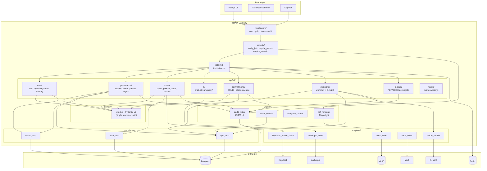

# C4 Component · Компоненты FastAPI

> [!info] Файл
> [`c4-component.drawio`](c4-component.drawio)

## Цель диаграммы

Раскрыть **внутреннюю структуру FastAPI Gateway** — основного backend-сервиса. Показать модули, их зависимости, направления вызовов. Используется backend-разработчиками при онбординге и code review.

## Inline mermaid версия

## Ключевые модули

### `middleware/`
Стек FastAPI middleware: CORS (только same-origin для UI + Superset), gzip, OpenTelemetry trace propagation, audit-context (binds trace_id к user_id).

### `security/`
- `verify_jwt(token)` — проверка через JWKS (cached 1 ч)
- `require_permission(perm: Permission)` — RBAC guard
- `require_domain(domain: str)` — ABAC guard, сверяет с claim `domains[]`
- `require_mfa()` — для critical actions (publish, decision approve)
- `set_user_context_in_db(conn, user)` — устанавливает GUC в Postgres connection: `app.user_id`, `app.user_domains`, `app.user_role`

### `ratelimit/`
Redis-based bucket per (user_id, route, window). Per-user квоты:
- viewer: 100 req/min general, 10 req/hour AI
- analyst: 300/min, 30/hour AI
- editor: 500/min, 30/hour AI
- admin: 1000/min, 60/hour AI

### `api/v1/data/`
Read-only API для UI. Все ответы кешируются в Redis на 5 мин. RLS-фильтр по `user_domains`.

### `api/v1/governance/`
- `GET /review-queue` — items по фильтру
- `POST /publish` — utility approve, требует MFA challenge
- `POST /reject` — с обязательным reason ≥ 30 char
- `POST /undo/{audit_id}` — откат публикации в течение 5 мин

### `api/v1/admin/`
Только для admin. Управление users (через Keycloak Admin API), policies (CRUD `source_version_policy`), audit-export.

### `api/v1/ai/`
Прокси к Anthropic. Server-side:
1. Prompt-injection фильтр (regex + ML)
2. PII redaction
3. RLS-аware context построение
4. Streaming responses
5. Output URL validation
6. Audit с prompt_hash + token usage

### `api/v1/commitments/`, `api/v1/decisions/`
CRUD + state machine. Decisions требуют E-IMZO подпись для approve.

### `api/v1/exports/`
Async PDF/DOCX рендеринг через Playwright в worker pod. Возврат via WebSocket / polling job_id.

### `domain/`
Pydantic v2 модели. **Single source of truth** для всей схемы. → OpenAPI 3.1 → TS-типы для UI.

### `repos/`
Asyncpg connection pool, схема-isolated. Каждый repo работает с одной schema, не пересекается.

### `workers/`
Background задачи:
- `audit_writer` — пишет с подписью Ed25519
- `pdf_renderer` — Playwright headless для экспорта
- `email_sender`, `telegram_sender` — асинхронные уведомления

### `adapters/`
Тонкие обёртки над внешними сервисами с retry + timeout + Otel trace.

## Принципы организации

> [!note] Hexagonal-light
> Не полноценный hexagonal, но: **routers (interfaces) → domain (core) → repos/adapters (infra)**. Бизнес-логика в `domain/` не зависит от FastAPI / asyncpg.

### Что **не** должно происходить

- ❌ Routers напрямую вызывают `asyncpg.connection` — только через `repos/`
- ❌ `domain/` импортирует FastAPI / asyncpg — это нарушает изоляцию
- ❌ Прямой SQL в routers — только через repos
- ❌ Бизнес-валидация в routers — только в Pydantic models / domain services

### Что должно происходить

- ✅ Каждый mutating route вызывает `audit_writer` — это **гарантированно**, через декоратор `@audited`
- ✅ Каждый response типизирован Pydantic-моделью
- ✅ Каждый long-running endpoint имеет timeout
- ✅ Каждый external call имеет circuit breaker (через `aiobreaker`)

## Производительность

- **Connection pool** на Postgres через pgBouncer (transaction-mode), внутри FastAPI — asyncpg pool size 10 на pod
- **Redis pool** size 20 на pod
- **Worker concurrency** — 16 (uvicorn workers)
- **Background tasks** — отдельный pod (Dramatiq), чтобы не блокировать API workers

## Тестирование

- Unit: pytest + pytest-asyncio, fakeredis, fakeapscheduler
- Integration: testcontainers Postgres
- Contract: schemathesis (генерирует тесты из OpenAPI)
- Load: k6 от тестовой среды

## Связанные документы

- Уровень контейнеров → [[c4-container]]
- Каталог компонентов → [[../02-component-catalog#fastapi-gateway]]
- Auth + RBAC → [[../03-authentication-rbac]]
