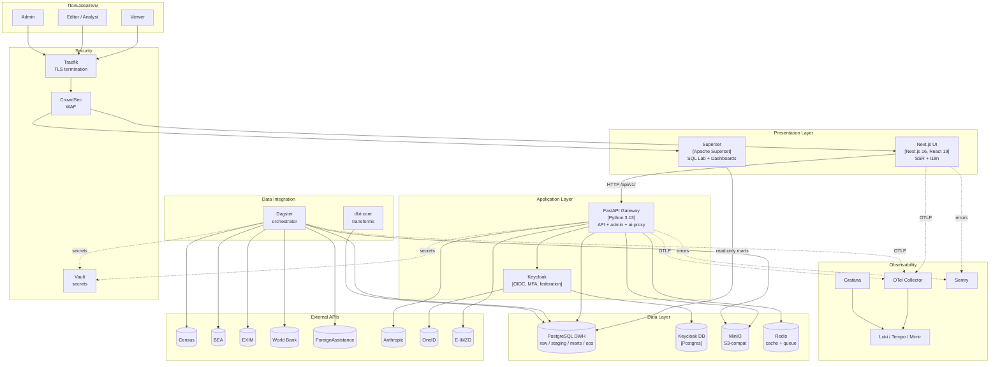

# C4 Container · Контейнеры платформы

> [!info] Файл
> [`c4-container.drawio`](c4-container.drawio)

## Цель диаграммы

Раскрыть **«чёрный ящик»** UZ-US Situational Platform: показать все сервисы (контейнеры в C4-смысле — runnable services), их технологии и связи. Это самая важная диаграмма для архитектора, DevOps, backend-разработчика.

## Inline mermaid версия

## Слои в деталях

### Presentation
- **Next.js UI** — главный UI для всех ролей кроме «глубокий аналитик». Server Components → FastAPI.
- **Superset** — отдельный UI для analyst-команды (SQL Lab, ad-hoc).

### Application
- **FastAPI Gateway** — единственная точка для всех API. Здесь auth-middleware, RBAC, audit-writer, AI proxy с rate-limit.
- **Keycloak** — OIDC, MFA, federation. Все три presentation-сервиса доверяют ему.

### Data
- **PostgreSQL DWH** — единое хранилище. Patroni HA. Схемы изолированы по назначению.
- **MinIO** — landing zone, экспорты, attachments, бэкапы.
- **Redis** — cache, rate-limit counters, очереди фоновых задач.
- **Keycloak DB** — отдельный Postgres специально для KC.

### Integration
- **Dagster** — оркестратор ingestion DAG'ов.
- **dbt** — SQL-трансформации, запускается из Dagster.

### Observability
- **OpenTelemetry collector** — централизованный приём.
- **LGTM stack** — Loki/Tempo/Mimir + Grafana.
- **Sentry** — frontend + backend errors.

### Security
- **Traefik** — TLS termination, маршрутизация. Edge ingress.
- **CrowdSec** — WAF / behavior detection.
- **Vault** — secret manager. Все credentials берутся отсюда.

## Ключевые связи

| От | К | Протокол | Заметка |
|---|---|---|---|
| Browser | Traefik | HTTPS 1.3 | Strict TLS, HSTS preload |
| Traefik | Next.js / Superset | HTTP в k3s mesh | mTLS включается на этапе 2 |
| Next.js | FastAPI | HTTP + JWT Bearer | OpenAPI генерирует TS-клиент |
| FastAPI | Keycloak | HTTPS · JWKS get | Cached на 1 час |
| FastAPI | Postgres | TLS · pgBouncer | RLS + GUC user-context |
| FastAPI | Redis | TCP · TLS | rate-limit, cache |
| FastAPI | MinIO | HTTPS · S3 API | Подписанные URL для downloads |
| FastAPI | Anthropic | HTTPS streaming | Через egress proxy с allowlist |
| Dagster | External APIs | HTTPS | Через egress proxy |
| Dagster | MinIO | S3 | raw snapshots |
| Dagster | Postgres | TLS | INSERT в raw.* |
| dbt | Postgres | TLS | trigger из Dagster |
| Все сервисы | OTel collector | OTLP gRPC | трасы, метрики, логи |
| Все сервисы | Vault | HTTPS · K8s SA token | при старте, через подписку |

## Тонкости и обоснования

### Почему **отдельный** Postgres для Keycloak

Если у KC общая БД с DWH — отказ DWH ломает всю аутентификацию (включая admin'а, который должен починить). Изоляция критически важна.

### Почему **Superset напрямую** в Postgres, а не через FastAPI

Superset делает тяжёлые ad-hoc SQL → нет смысла оборачивать в API. Безопасность — через RLS + dedicated `marts_reader` user без прав на `ops.*`/`auth.*`.

### Почему **Vault**, а не K8s secrets

K8s secrets — base64, не зашифрованы по умолчанию. Vault даёт:
- ротация
- audit trail
- dynamic secrets (создаваемые на лету, короткий TTL)
- leases

### Почему **CrowdSec** на edge

Бесплатный аналог enterprise WAF. Сообщество шерит сигнатуры, защита от bot-net'ов и брутфорса. Bouncer интегрирован с Traefik.

## Точки расширения

> [!tip] Когда добавлять сервисы
> - **Search** (Elasticsearch / OpenSearch) — если потребуется full-text search по комментариям и audit-log. Сейчас pg_trgm в Postgres хватает.
> - **MQ** (RabbitMQ / NATS) — если число фоновых задач превысит 100/сек, текущий Redis-queue не справится.
> - **CDN** — внешний CDN не нужен (on-prem, малая аудитория). Если откроете публичный read-only канал → CloudFlare or Imperva.

## Связанные документы

- Уровень контекста → [[c4-context]]
- Уровень компонентов FastAPI → [[c4-component]]
- Развёртывание (физический уровень) → [[deployment]]
- Каталог компонентов → [[../02-component-catalog]]
