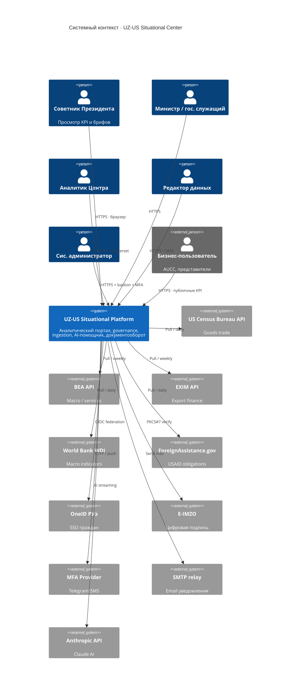

# C4 Context · Системный контекст

> [!info] Файл
> [`c4-context.drawio`](c4-context.drawio)

## Цель диаграммы

Показать **границы системы** UZ–US Situational Center: какие категории пользователей с ней работают, к каким внешним системам она обращается. Это самый высокий уровень — без деталей внутреннего устройства.

## Как читать

1. **Центральный прямоугольник** — наша платформа. Без внутренней структуры — это «чёрный ящик».
2. **Слева** — категории пользователей (акторы).
3. **Справа** — внешние системы и API.
4. **Стрелки** — направление потока (кто кого вызывает).
5. **Подписи на стрелках** — суть взаимодействия.

## Inline mermaid версия

## Легенда

| Элемент | Что значит |
|---|---|
| 👤 Person (синий) | Внутренний пользователь Центра / правительства |
| 👤 Person Ext (серый) | Внешний пользователь (бизнес) |
| 📦 System (зелёный) | Наша система |
| 📦 System Ext (синий) | Внешняя система / API |
| → Стрелка | Направление вызова / запроса |

## Принципиальные узлы

### Платформа = чёрный ящик

На этом уровне неважно, из чего состоит платформа. Важно зафиксировать:
- Кто с ней общается
- К чему она обращается
- Какие границы

### Все внешние API — в США

Это создаёт необходимость **outbound egress proxy** (squid) в нашей сети с allowlist FQDN. Подробнее → [[../01-target-architecture#Развёртывание]].

### OneID — единственный канал внешней идентификации

Бизнес-пользователи (AUCC) логинятся не через локальные учётки, а через OneID РУз. Это снимает с нас ответственность за authentication внешних людей.

### E-IMZO — обязательно для подписи

Без E-IMZO нет легитимных подписанных решений → нет workflow для executive. См. [[../05-user-journeys#4. Executive]].

## Что выясняется из диаграммы

> [!warning] Outbound dependency на US-инфраструктуре
> 5 источников + Anthropic — все в США. При гео-блокировке (на стороне US gov или прокси-провайдера РУз) — degradation. Mitigation: cache в `raw.*`, static fallback.

> [!note] OneID не критичен для core функций
> Внутренние пользователи логинятся через AD federation (LDAP) → если OneID лежит, бизнес-канал отключается, но Центр продолжает работу.

## Связанные документы

- Целевая архитектура → [[../01-target-architecture]]
- Уровень контейнеров → [[c4-container]]
- Развёртывание → [[deployment]]
- Bottlenecks по outbound API → [[../07-bottlenecks-and-risks#1.3]]
