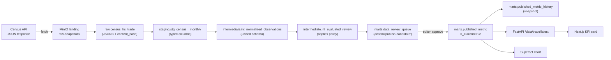
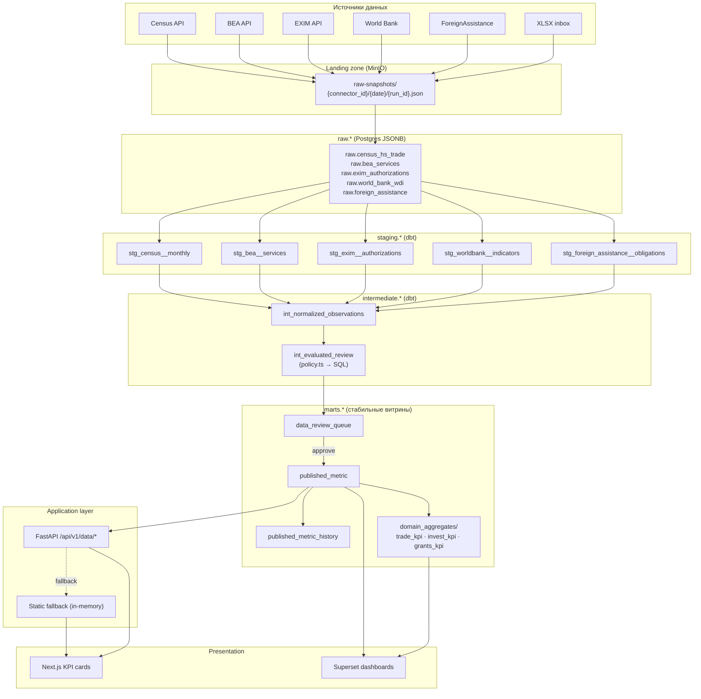

# Data Lineage · Поток данных от источника до UI

> [!info] Файл
> [`data-lineage.drawio`](data-lineage.drawio)

## Цель

Показать **происхождение каждого значения** на дашборде — от внешнего API до карточки KPI. Используется аналитиками для проверки достоверности и при инцидентах «откуда такая цифра».

## Принципиальный путь одной метрики



## Inline mermaid версия (полная)



## Колонки и преобразования

### От API до `staging`

```
Census API JSON:
  [["CTY_NAME", "ALL_VAL_MO", "time", ...], ["UZBEKISTAN", "37200000", "2026-04", ...]]
  ↓ fetch + sha256(content) для дедупа
  ↓ INSERT INTO raw.census_hs_trade (run_id, content_hash, payload)

raw.census_hs_trade.payload (JSONB):
  {"rows": [...], "headers": [...]}
  ↓ dbt
  ↓ stg_census__monthly: SELECT (row->>'time')::date, (row->>'ALL_VAL_MO')::numeric / 1e6 ...

staging.stg_census__monthly:
  | period_end | exports_usd_m | imports_usd_m | source_published_at |
  | 2026-04-30 | 37.2          | 8.1           | 2026-05-08          |
```

### От `staging` до `marts.published_metric`

```
staging.stg_census__monthly
  ↓ int_normalized_observations: маппинг колонок → metric_key + dimensions
  | metric_key                         | dimensions          | value | period_end |
  | trade.us.goods.monthly.exports     | {flow:exports,...}  | 37.2  | 2026-04-30 |
  ↓ int_evaluated_review: для каждой observation сравнить с current published_metric
  | observation                | current_value | action            |
  | (37.2, 2026-04-30)         | (38.1, 2026-04-30)  | manual-review (same period) |
  | (33.0, 2026-03-31)         | (38.1, 2026-04-30)  | reject-older-period (block) |
  ↓ INSERT INTO marts.data_review_queue
  ↓ editor approves один из items
  ↓ UPDATE marts.published_metric SET is_current = false WHERE metric_identity = X
  ↓ INSERT INTO marts.published_metric (..., is_current=true)
```

## Якоря lineage

> [!important] Каждое значение в UI трассируется до raw-snapshot

Цепочка для любой цифры:

1. `marts.published_metric.id` → SELECT по этому id
2. `published_metric.connector_id + period_end` → найти `data_review_queue.observation`
3. `observation.fetched_at` → `raw_source_snapshot.fetched_at`
4. `raw_source_snapshot.payload` → исходный JSON ответ источника

UI на каждой карточке имеет кнопку **«Источник»** → ведёт на `source_url` + хеш snapshot'а в audit log.

## Lineage tooling

### dbt docs

`dbt docs generate` → визуальный DAG моделей с описанием каждой колонки.
Доступ: `https://dbt-docs.uzus.local`

### Dagster asset graph

Dagster показывает asset-graph: `census_api → minio_snapshot → raw.census → stg_census → marts.published_metric`. Lineage-time показывает время последней успешной материализации.

### Custom lineage в UI

В админке `/admin/lineage/{metric_id}` — собственный визуализатор: дерево от UI-карточки до raw-snapshot, с timestamps каждого шага.

## Точки прерывания (data quality boundaries)

| Точка                           | Что проверяется                  | Что делать при сбое                                           |
| ------------------------------- | -------------------------------- | ------------------------------------------------------------- |
| API → MinIO                     | HTTP 200, content-length > 0     | retry x3, alert                                               |
| MinIO → raw.*                   | JSONB валиден, hash совпадает    | reject, alert                                                 |
| raw → staging                   | Schema validation (Pydantic)     | unknown-fields → quality_flag, отсутствие обязательных → fail |
| staging → intermediate          | Type coercion, обязательные поля | Pydantic ошибка → fail run                                    |
| intermediate → review queue     | policy applied                   | `reject-older-period` идёт в queue со severity=block          |
| review queue → published_metric | editor approve + MFA             | без approval — нет публикации                                 |
| published_metric → API          | RLS check по user.domains        | unauthorized → 403                                            |
| API → UI                        | TS типы из OpenAPI               | mismatch → CI fail на этапе сборки                            |

## Связанные документы

- Полный data-flow → [[../04-data-flow]]
- BPMN ingestion → [[bpmn-ingestion]]
- BPMN publication → [[bpmn-publication]]
- UML данных → [[uml-data-model]]
