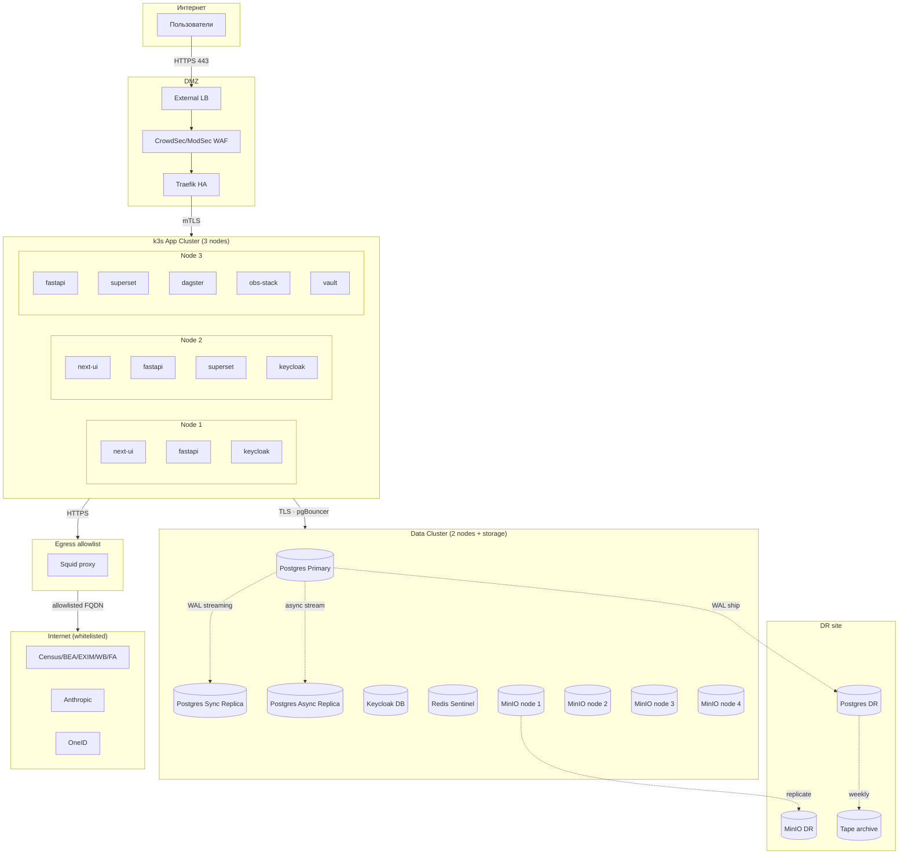

# Deployment · Топология on-prem развёртывания

> [!info] Файл
> [`deployment.drawio`](deployment.drawio)

## Цель

Показать **физическую топологию** развёртывания платформы в ЦОД РУз. Используется DevOps/SRE/ИБ для понимания сетевых границ, расположения узлов, путей трафика.

## Inline mermaid версия

## Топологические уровни

### Internet → DMZ

- **External LB** (BGP / VRRP) — балансировщик нагрузки на 2-3 IP
- **WAF + DDoS protection** — CrowdSec community + ModSecurity rules
- **Traefik HA** — TLS 1.3 termination, ACME автоматический Let's Encrypt (или гос. УЦ)

Только Traefik имеет внешние порты 80/443. Всё остальное — internal network.

### DMZ → App Cluster

- mTLS обязательно для service-to-service
- ServiceMesh: Linkerd 2 или Istio (Linkerd проще на 3-узловом кластере)
- Network policies (Cilium): default-deny, явный allow

### App Cluster (k3s)

- 3 узла k3s, по 16GB RAM / 8 vCPU / 1TB SSD
- Distributed scheduling — каждый сервис не должен быть на одном узле со своей репликой
- Storage: rook-ceph для StatefulSets (Sentry, Loki) или local-path-provisioner

### Data Cluster

- 2 узла Postgres (32GB RAM / 8 vCPU / 4TB NVMe)
- Patroni + etcd 3 (etcd на app-cluster или dedicated узел)
- 1 async replica для Superset / read-heavy queries
- MinIO 4 узла Erasure-coded (4+2)
- Redis Sentinel (3 узла, может на app-cluster)

### DR site

- Asynchronous replication из primary site
- Cold standby, активируется вручную через runbook
- RPO 5 минут / RTO 4 часа

### Egress

- Squid proxy с allowlist FQDN (см. [[../01-target-architecture#Развёртывание]])
- Никакой outbound трафик не идёт мимо squid (NetworkPolicy + Firewall)
- Логирование всех egress requests в Loki

### Bastion

- Отдельный узел вне k3s
- SSH с обязательным 2FA (Yubikey)
- Только DBA + Admin
- pgAudit для всех Postgres-сессий через bastion

## Сети

| Сегмент | CIDR (пример) | Назначение |
|---|---|---|
| public | публичные IP | Traefik external |
| dmz | 10.10.0.0/24 | Traefik, WAF |
| app | 10.20.0.0/24 | k3s nodes |
| data | 10.30.0.0/24 | Postgres, MinIO, Redis |
| obs | 10.40.0.0/24 | Loki, Tempo, Grafana storage |
| egress | 10.50.0.0/30 | Squid proxy |
| bastion | 10.60.0.0/29 | DBA/Admin SSH |
| dr | 10.100.0.0/16 | DR site |

Firewall между сегментами: explicit allow only.

## High Availability matrix

| Компонент | Реплик | Режим | RTO | RPO |
|---|---|---|---|---|
| Traefik | 2 | active-active | < 30s | 0 |
| Next.js | 2 | active-active | < 30s | 0 |
| FastAPI | 3 | active-active | < 30s | 0 |
| Superset | 2 | active-active | < 1m | 0 |
| Keycloak | 2 | active-active с shared DB | < 1m | 0 |
| Postgres DWH | 2 (HA) + 1 async | sync replica + async | < 5s | < 1s |
| MinIO | 4 | EC 4+2 | < 30s | 0 |
| Redis | 1+2 | Sentinel | < 30s | < 1s |
| Dagster | 1 | singleton (state в Postgres) | < 5m | 0 |
| LGTM stack | 1 каждый | non-critical | < 1h | acceptable |

## Compliance аспекты

> [!warning] Резидентность
> Все узлы — в дата-центрах РУз. Egress только на approved FQDN. Это ключевое для compliance с законом РУз о ПДн.

### Шифрование

| Где | Тип | Управление ключами |
|---|---|---|
| Disk (DWH, MinIO) | LUKS / encrypted disks | Vault unseal-keys |
| Postgres at-rest | TDE (если используется postgres-tde) или disk-level | Vault |
| MinIO objects | SSE-S3 with KMS | Vault |
| TLS in-transit | TLS 1.3 only | Let's Encrypt / гос. УЦ |
| mTLS internal | Cilium-managed certs | rotated weekly |
| Backups | encrypted by pgBackRest | Vault key |

### Аудит сети

- Все egress requests → Loki (через Squid access log)
- Все ingress requests → Loki (через Traefik access log)
- pgAudit logs — каждый SELECT отдельно (только для admin/bastion)
- Анализ через Grafana / отдельный SIEM

## Связанные документы

- Контейнеры → [[c4-container]]
- Безопасность → [[../03-authentication-rbac]]
- Узкие места деплоя → [[../07-bottlenecks-and-risks]]
