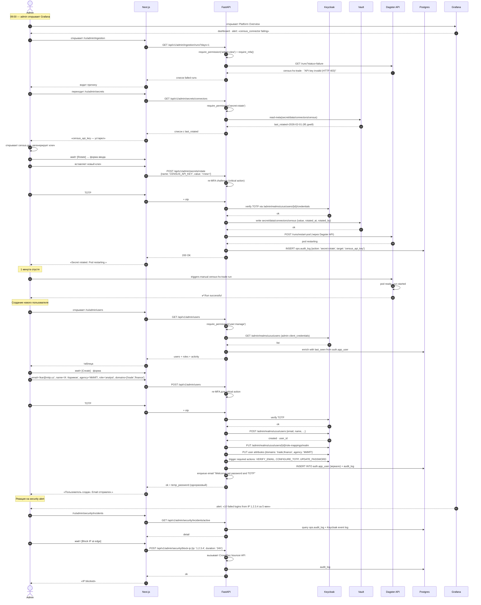

# Journey · Admin

> [!info] Файл
> [`journey-admin.drawio`](journey-admin.drawio)

## Сценарий

Утром admin делает health-check, реагирует на инцидент с истекшим API-ключом, потом создаёт нового пользователя.

## Inline mermaid

## Особенности admin-сценариев

### Re-MFA для critical actions

Не достаточно session-MFA при логине. Каждое из:

- secret rotation
- user creation / role assignment
- maintenance mode toggle
- audit export
- block IP / force logout

требует **повторного TOTP** в момент действия. Это защита от угнанной session.

### Audit на всё

Каждое действие admin пишется в `ops.audit_log` с полным контекстом:

- before / after state
- IP, User-Agent
- target (user_id / secret_name / etc)
- reason (если требуется)
- Ed25519 signature

### Никаких прямых SQL

Admin **не может** выполнять SQL напрямую через UI. Для emergency — bastion-host с pgAudit. Это разделение даёт audit trail на уровне БД.

### Vault-only для secrets

Никакие секреты не показываются в UI. Только:

- last_rotated date
- rotated_by user
- secret name

Чтобы посмотреть значение → bastion + Vault CLI с дополнительным MFA.

## Связанные

- Auth → [[auth-sequence]]
- Полный гид по journeys → [[../05-user-journeys#5. Admin]]
- RBAC → [[rbac-matrix]]
