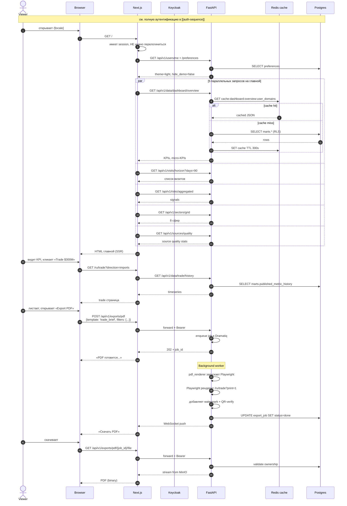

# Journey · Viewer

> [!info] Файл
> [`journey-viewer.drawio`](journey-viewer.drawio)

## Сценарий

Сотрудник Аппарата Президента открывает утренний бриф. Цель — увидеть свежие KPI, ближайшие визиты, сигналы рисков.

## Inline mermaid

## Ключевые особенности

### Параллельная загрузка

Главная страница открывается ~700 ms за счёт **параллельных fetch** в server components: 5 запросов одновременно через `Promise.all`. Backend кеширует ответы в Redis на 5 минут — повторные открытия за 50-200 ms.

### RLS-фильтрация на уровне БД

`viewer.domains` проходит через GUC в Postgres. Если у viewer нет домена `security`, RLS-policy на `marts.published_metric` отфильтрует строки. UI получает уже отфильтрованный набор без лишних проверок.

### Async PDF export

Принципиально не блокируем HTTP-запрос на рендеринг: enqueue → 202 Accepted → background worker → WebSocket / polling.

### Что viewer **не** видит

- Действия approve/reject в UI скрыты
- `/admin/*` — 404 на frontend (не редирект, не 403, чтобы не давать info-leak)
- `/api/v1/admin/*` от backend → 403 если попытается дёрнуть напрямую

## Связанные

- Auth → [[auth-sequence]]
- Полный гид по journeys → [[../05-user-journeys]]
