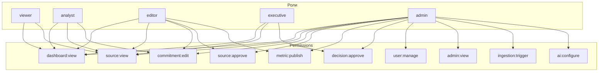

# RBAC Matrix · Роли × разрешения × домены

> [!info] Файл
> [`rbac-matrix.drawio`](rbac-matrix.drawio)

## Цель

Чёткая матрица: какая роль что может делать на каких доменах. Используется ИБ при аудите, разработчиками при добавлении новых endpoints.

## Полная матрица

См. полную таблицу: [[../03-authentication-rbac#Матрица доступов на ресурсы]].

### Краткая сводка по ресурсам

| Ресурс                      | viewer        | analyst    | editor   | executive | admin      |
| --------------------------- | ------------- | ---------- | -------- | --------- | ---------- |
| Dashboard                   | R             | R          | R        | R         | R          |
| Trade / Macro / Investments | R             | R          | RW       | R         | RW         |
| Commitments                 | R             | RW (own)   | RW       | R         | RW         |
| Decisions (создание)        | —             | RW (draft) | RW       | RW        | RW         |
| Decisions (approve)         | —             | —          | —        | RW + sign | RW + sign  |
| Review queue                | —             | R          | RW + MFA | —         | RW + MFA   |
| Source policies             | R             | R          | R        | —         | RW         |
| Users                       | —             | —          | —        | —         | RW         |
| Audit log                   | —             | —          | R (own)  | R (own)   | R (all)    |
| AI assistant                | RW (rate-lim) | RW         | RW       | RW        | RW (admin) |
| Maintenance mode            | —             | —          | —        | —         | RW         |
| Force logout                | —             | —          | —        | —         | RW         |
| Secrets rotation            | —             | —          | —        | —         | RW         |
| Superset                    | —             | RW         | RW       | —         | RW         |

### Краткая сводка по доменам (ABAC)

| Роль           | trade | macro | assist | finance | mobility | educ | security | ops |
| -------------- | ----- | ----- | ------ | ------- | -------- | ---- | -------- | --- |
| viewer         | R     | R     | R      | R       | R        | R    | —        | —   |
| analyst (МИИП) | RW    | R     | R      | RW      | —        | —    | —        | R   |
| analyst (МИД)  | R     | R     | RW     | R       | RW       | RW   | R        | —   |
| editor (cross) | RW    | RW    | RW     | RW      | RW       | RW   | RW       | R   |
| executive      | R     | R     | R      | R       | R        | R    | R        | R   |
| admin          | RW    | RW    | RW     | RW      | RW       | RW   | RW       | RW  |

## Inline mermaid (heatmap-style)



## Принципы наследования

Роли иерархичны:

- `analyst` ← `viewer` (анlyst всё, что может viewer + commitments)
- `editor` ← `analyst` (+ approve)
- `executive` отдельно (виды viewer + approve decisions, но не редактирует данные)
- `admin` объединяет всё

## Защита на уровне БД (RLS)

Каждый ресурс защищается **дважды**:

1. **FastAPI guard** — `Depends(require_permission(...))`
2. **Postgres RLS** — `current_setting('app.user_role')` + `app.user_domains`

```sql
-- Пример: published_metric видна только разрешённым доменам
create policy view_by_domain on marts.published_metric
  for select to app_role
  using (
    domain = ANY(string_to_array(current_setting('app.user_domains', true), ','))
  );

-- Пример: commitments видны только actor + co_owners + executive домена
create policy view_commitments on ops.commitment_record
  for select to app_role
  using (
    created_by = current_setting('app.user_id', true)::uuid
    OR co_owners @> array[current_setting('app.user_id', true)]
    OR (
      current_setting('app.user_role', true) IN ('editor', 'executive', 'admin')
      AND sphere = ANY(string_to_array(current_setting('app.user_domains', true), ','))
    )
  );
```

> [!warning] Default deny
> Если RLS-policy не создана для таблицы — **никто не имеет доступа** (по умолчанию RLS блокирует всё). Это намеренно: лучше получить пустой результат, чем утечку.

## Connection-level isolation

Postgres user `app_role` не имеет ни одного permission по умолчанию. Все доступы через RLS-policies. Поэтому даже компрометация app-cluster credentials не даёт прямого SELECT в `auth.app_user` или `ops.audit_log`.

## Связанные документы

- Auth/RBAC документ → [[../03-authentication-rbac]]
- Sequence входа → [[auth-sequence]]
