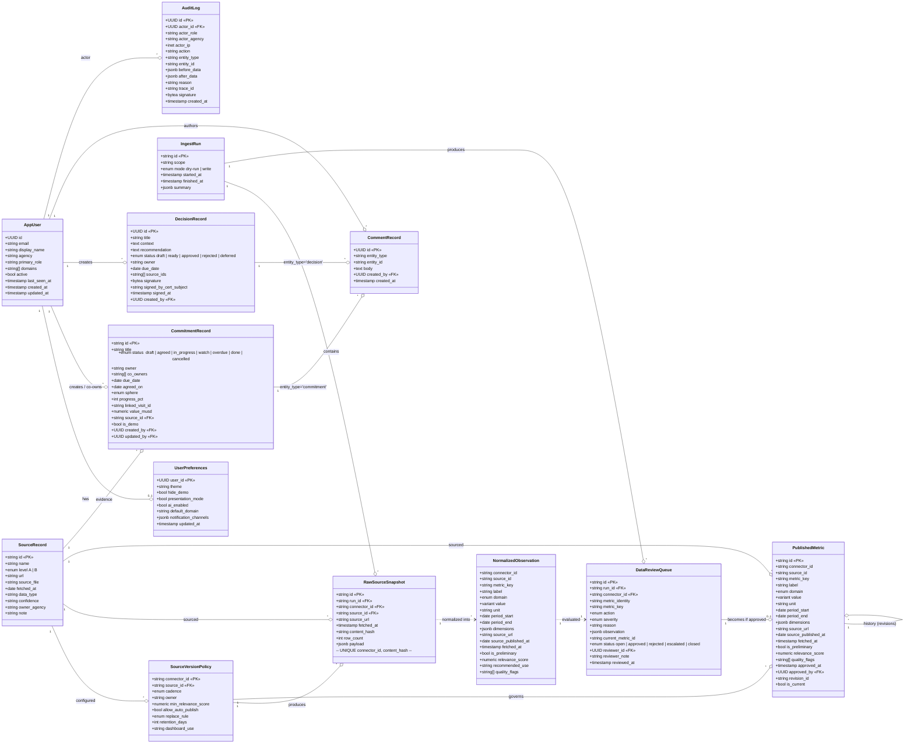

# UML · Data Model

> [!info] Файл
> [`uml-data-model.drawio`](uml-data-model.drawio)

## Цель

Показать **класс-модель данных** платформы — все основные сущности, их атрибуты, связи. Используется backend-разработчиками при создании Pydantic-моделей и dbt-моделей, DBA при review SQL-схемы, аналитиками при ad-hoc запросах в Superset.

## Группировка

| Schema                 | Сущности                                                                                    | Назначение                |
| ---------------------- | ------------------------------------------------------------------------------------------- | ------------------------- |
| `auth.*`               | AppUser, UserPreferences                                                                    | identity-зеркало Keycloak |
| `marts.*`              | PublishedMetric, PublishedMetricHistory, DataReviewQueue, SourceVersionPolicy, SourceRecord | governance-данные         |
| `raw.*`                | RawSourceSnapshot                                                                           | сырые snapshots           |
| `staging/intermediate` | NormalizedObservation, ReviewQueueItem                                                      | dbt-промежуточные         |
| `ops.*`                | CommitmentRecord, DecisionRecord, CommentRecord, AuditLog, IngestRun                        | операционные              |

## Inline mermaid · class diagram



## Ключевые инварианты

### `metric_identity` — стабильный ключ

```python
metric_identity = metric_key + "::" + sorted(dimensions)
```

Используется для сравнения versions без зависимости от порядка ключей в JSONB. Является **деривативным** значением — не хранится отдельно, вычисляется по требованию.

### Один `is_current=true` per metric_identity

Constraint:

```sql
create unique index published_metric_current_unique
  on marts.published_metric (metric_key, dimensions)
  where is_current = true;
```

При утверждении новой записи — старая `UPDATE SET is_current = false` в той же транзакции.

### `value` — variant

В Postgres реализуется как 3 nullable колонки + check:

```sql
check (
  (value_num is not null)::integer +
  (value_text is not null)::integer +
  (value_bool is not null)::integer = 1
)
```

В Pydantic — `Union[float, str, bool]`. В TS — discriminated union по `value_kind`.

### WORM на `audit_log`

Триггер `before update / before delete → return null` блокирует мутацию. Вставка только через FastAPI с подписью Ed25519.

### `is_demo` пропагация

Если запись помечена `is_demo: true`:

- В UI отображается с `DemoBadge`
- При `hideDemo=true` — скрывается
- В прод-DWH (`DATA_BACKEND=dwh, target=prod`) — dbt-test блокирует попадание в `marts.published_metric`

## Связанные

- Полное описание data-flow → [[../04-data-flow]]
- Lineage диаграмма → [[data-lineage]]
- Структура таблиц SQL → [database/schema.sql](../../../database/schema.sql)
